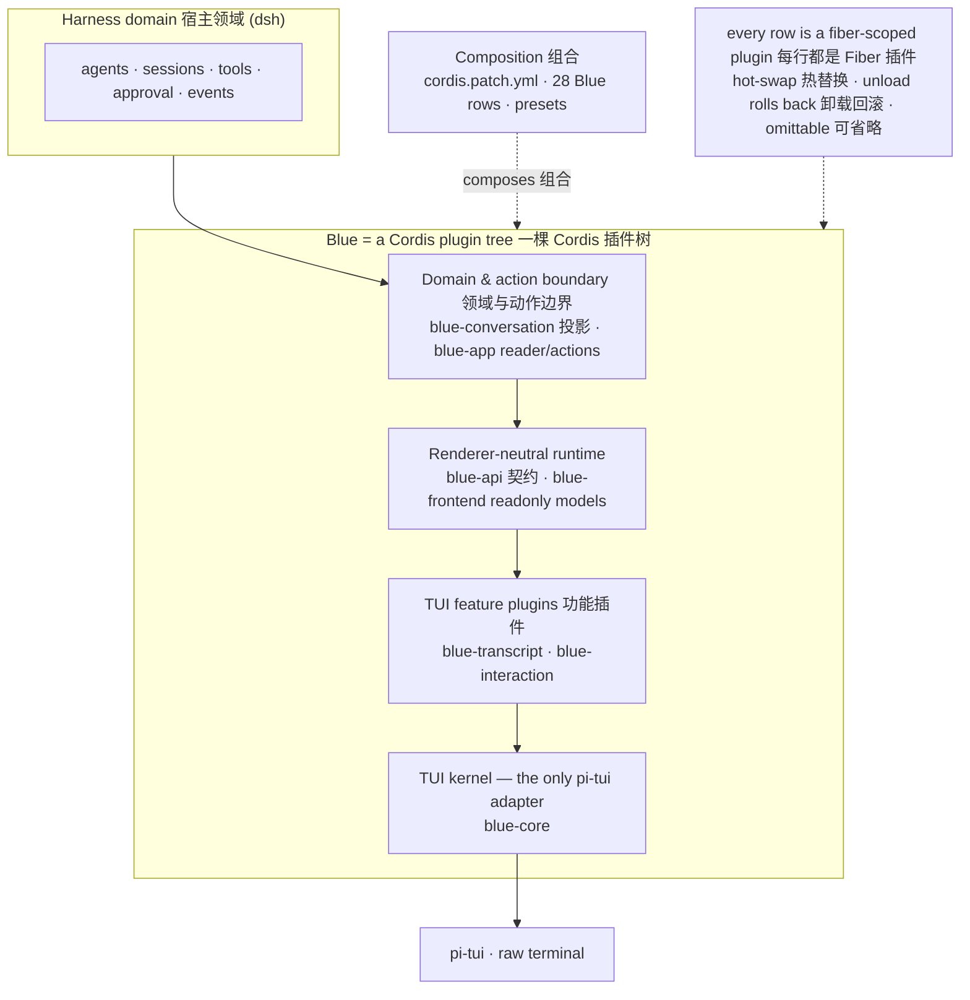

# Blue

[](https://github.com/dsh-blue/blue/actions/workflows/ci.yml)
[](#usage)
[](#usage)
[](LICENSE)
[](https://dsh-blue.dev/en/)

English | [中文](README.zh.md)

Blue is an interactive terminal UI (TUI) for [DeepSeek Harness](https://github.com/deepseek-ai/deepseek-harness) (`dsh`): a `pi-tui` renderer mounted as an out-of-tree [Cordis](https://www.npmjs.com/package/@deepseek-ai/cordis) plugin bundle on top of the `dsh-base` bundle. This repository contains fourteen workspace packages — ten in the `0.1.0-rc.8` release set and four validation-only adapters — built and tested against the published Harness `0.1.1-rc.2` line.

<p align="center">
  <video src="https://dsh-blue.dev/blue-demo.mp4" width="720" autoplay loop muted playsinline controls></video>
</p>
<p align="center"><i>Blue in action: streaming transcript, tool cards, and dock panes.</i></p>

## Design philosophy

**A TUI is not a package — it is a Cordis plugin tree.** Every render component, interaction provider, command, and status entry is a separate plugin with its own fiber lifecycle: hot-swappable and omittable at will.

- **Registration is an effect** — mounts, provider registrations, and keybindings bind through `ctx.effect`/`ctx.on`, so unloading a plugin rolls everything back; HMR and session switching come free.
- **Dependency-derived loading** — plugins `inject` what they need and wait until the services exist; a provider hot-swap unloads and reloads its dependents automatically.
- **plain-first** — every non-trivial surface is a seam plus a plain default implementation. Blue's own enhancements register through the same seams as downstream plugins; the bundle with every enhancement row removed still boots and works.
- **One pi-tui import** — only `packages/core` imports `@earendil-works/pi-tui`, and no public contract mentions a pi-tui type.

The full story: [docs/blue-architecture.md](docs/blue-architecture.md) · decisions (ADR): [docs/blue-decisions.md](docs/blue-decisions.md) (both Chinese).

## Usage

> [!NOTE]
> `0.1.0-rc.8` is a preview release published under the **`rc` dist-tag** — install specs carry the `@rc` suffix; upgrading is the same command again.

Prerequisites: Node `^22.19 || >=24`, pnpm 11, and a `dsh` CLI ≥ `0.1.1-rc.2`.

```sh
npm i -g @deepseek-ai/dsh
dsh plugin --profile blue add @dsh-blue/blue@rc
dsh --profile blue
```

Or install the standalone `blue` launcher, which bundles a pinned dsh host and manages the `blue` profile itself:

```sh
npm i -g @dsh-blue/blue-cli@rc
blue
```

Set `DEEPSEEK_API_KEY` before the first run. Key bindings and slash commands are listed live by `/help` and documented in the [key reference](https://dsh-blue.dev/en/reference/keys/) and [command reference](https://dsh-blue.dev/en/reference/commands/); the [quickstart](https://dsh-blue.dev/en/guide/) walks through the first run, and the [configuration guide](https://dsh-blue.dev/en/guide/config/) covers providers, models, and themes.

## Architecture

<!-- BEGIN diagram:blue-layers -->
<!-- single source 单一来源: docs/diagrams/blue-layers.mmd — edit the .mmd, then `pnpm run diagrams:sync` -->

<!-- END diagram:blue-layers -->

The runtime flow is `Harness domain -> projection/action boundary -> renderer-neutral models -> TUI feature plugins -> core`. Events state facts, projections hold current state, and actions are write requests with structured results; Blue never keeps a second agent truth, and Agent/Session objects never cross into renderers. The row-by-row bundle composition (28 Blue-owned rows over `dsh-base`) is documented in [the bundle guide](https://dsh-blue.dev/en/plugins/builtins/), and the feature tour is on [the website](https://dsh-blue.dev/en/features/).

## Documentation

- **User manual** — [quickstart](https://dsh-blue.dev/en/guide/) · [features](https://dsh-blue.dev/en/features/) · [key & command reference](https://dsh-blue.dev/en/reference/commands/) (中文: [指南](https://dsh-blue.dev/guide/) · [功能](https://dsh-blue.dev/features/) · [参考](https://dsh-blue.dev/reference/commands/))
- **Developer manual** — [writing a plugin](https://dsh-blue.dev/en/plugins/) · [seam reference](https://dsh-blue.dev/en/plugins/seams/) · [contributing](https://dsh-blue.dev/en/plugins/contributing/)
- **Harness handbook** — [dsh concepts, profiles, tools, MCP](https://dsh-blue.dev/en/dsh/)
- **Design documents** (Chinese, repo-internal) — the living/archived index is [docs/README.md](docs/README.md); repo-wide conventions live in [AGENTS.md](AGENTS.md) and each package's own `AGENTS.md`.

## License

[MIT](LICENSE). Every package under the `@dsh-blue` scope declares `license: MIT`.
