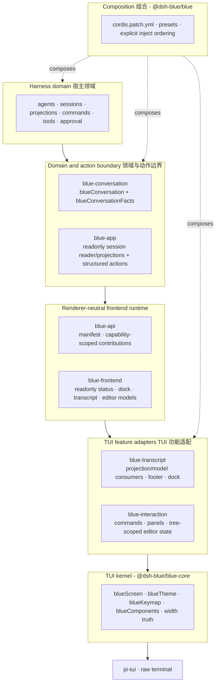
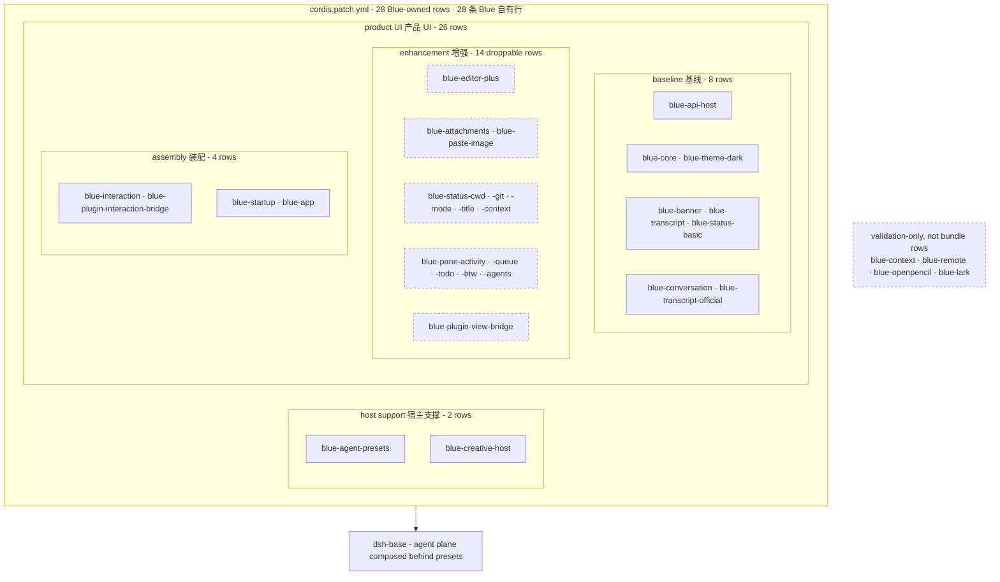

# Blue

[](https://github.com/dsh-blue/blue/actions/workflows/ci.yml)
[](#quick-start)
[](#quick-start)
[](LICENSE)
[](https://dsh-blue.dev/en/)

English | [中文](README.zh.md)

Blue is an interactive terminal UI (TUI) plugin for [DeepSeek Harness](https://github.com/deepseek-ai/deepseek-harness) (`dsh`): a `pi-tui` renderer mounted as an out-of-tree [Cordis](https://www.npmjs.com/package/@deepseek-ai/cordis) plugin bundle on top of the `dsh-base` bundle. Its core claim: **a TUI is not a package — it is a Cordis plugin tree.** Every render component, interaction provider, command, and status entry is a separate plugin with its own fiber lifecycle, hot-swappable and omittable.

This repository contains fourteen workspace packages: ten in the `0.1.0-rc.9` release set and four validation-only adapters. They build and test against the published Harness `0.1.1-rc.2` line and vendored Cordis.

<!-- TODO: demo capture — record a real session (vhs / asciinema; the script(1)
     smoke-check in the contributor guide is the seed), export a GIF into docs/assets/,
     and embed it here. A TUI repo's README lives or dies on its demo. -->

## Contents

- [Quick start](#quick-start)
- [Features](#features) — [Key bindings](#key-bindings) · [Slash commands](#slash-commands)
- [Design philosophy](#design-philosophy)
- [Layered architecture](#layered-architecture)
- [The Editor seam, in brief](#the-editor-seam-in-brief)
- [Development](#development)
- [Documentation](#documentation)
- [Relationship to deepseek-harness](#relationship-to-deepseek-harness)
- [License](#license)

## Quick start

> [!NOTE]
> `0.1.0-rc.9` is the preview release, published under the **`rc` dist-tag** — `latest` stays reserved for the stable line, so install specs carry the `@rc` suffix.

Prerequisites: Node `^22.19 || >=24`, pnpm 11, and a `dsh` CLI ≥ `0.1.1-rc.2` (`npm i -g @deepseek-ai/dsh`).

### Install from npm

```sh
npm i -g @deepseek-ai/dsh
dsh plugin --profile blue add @dsh-blue/blue@rc
```

After installing, see the [quickstart](https://dsh-blue.dev/en/guide/) for launching and a first run; models, providers, themes, and API keys are covered in the [configuration guide](https://dsh-blue.dev/en/guide/config/).

The `@rc` suffix is required: preview releases only carry the `rc` dist-tag, so a bare spec — which resolves `latest` — finds nothing. Upgrading to a newer preview is the same `plugin add` again; the spec re-resolves.

## Features

- **Streaming transcript** — projection-backed user/assistant Markdown while it streams, with canonical diff, terminal, search, read, and web tool-card presentation.
- **Input editor** — rounded-box editor with fuzzy slash-command autocomplete, argument ghost hints, `!` bash mode, `@` file completion, `#` skill completion, and Ctrl-V clipboard image paste.
- **Overlays** — four-option approval panel (with session-level "always allow" inheritance) and tabbed user-questionnaire overlays.
- **Two-row status footer** — model name, session-mode badge, git branch, and context occupancy `ctx N`, all published as readonly `StatusModel` values.
- **Bottom dock panes** — activity spinner while the agent runs, queued inbox messages, todo list, a `/btw` side-question pane that forks the live session, and the subagent-group pane.
- **Theming** — `/theme` hot-switching across `dark` / `light` / `auto` (OSC 11 background detection) / `custom` (JSON palette).
- **Extensible by construction** — external commands, status, dock, and notifications use the capability-scoped `bluePluginHost`; the completion menu and `/help` reflect the live registry.

User-facing feature guides live on the documentation website: [dsh-blue.dev/en/features](https://dsh-blue.dev/en/features/) (English) · [dsh-blue.dev/features](https://dsh-blue.dev/features/) (中文).

### Key bindings

The `/help` overlay lists every registered binding live — it is the authoritative source:

| Key | Action |
| --- | --- |
| `Shift+Tab` | Cycle session mode: normal → plan → yolo (`/yolo` auto-approves tool calls; questions still pop) |
| `Ctrl-C` | Clear the draft → interrupt the agent; a second press within 1 s exits |
| `Ctrl-S` | Steer the running turn with the draft |
| `Ctrl-V` | Paste a clipboard image as an `[image #N]` marker |
| `Ctrl-O` | Expand/collapse the last 3 turns of tool output and thinking blocks |
| `Ctrl-T` | Fold/unfold the todo pane |
| `↑` (empty editor) | Recall the most recent queued inbox message |

In the editor, the prefixes `/` `!` `@` `#` trigger command, bash, file, and skill completion respectively; a `#name` token anywhere in the line rewrites to the upstream `/name` skill gesture on submit.

### Slash commands

All commands auto-list in the editor's completion menu; `/help` is the live truth:

| Command | Aliases | Description |
| --- | --- | --- |
| `/quit` | `/q` `/exit` | Exit Blue |
| `/new` | `/clear` | Start a new session |
| `/fork` | — | Fork the current session into a new one |
| `/sessions` | `/resume` | List persisted sessions and switch; an id resumes directly |
| `/btw` | — | Side question: fork the live session and ask |
| `/help` | — | Show available commands and key bindings |
| `/model` | — | Switch the session model (no argument opens the picker) |
| `/effort` | `/thinking` | Switch the thinking effort of the current model |
| `/provider` | — | List providers, switch the route, or add one |
| `/preset` | — | List agent presets or switch (blank sessions only) |
| `/yolo` | `/yes` | Toggle auto-approval of tool calls |
| `/tools` | — | List the tools visible to the current session |
| `/mcp` | — | Browse the MCP servers the host connects to (read-only) |
| `/skills` | — | List available skills (the `#` prompt invokes one) |
| `/theme` | — | Switch the color theme |
| `/init` | — | Analyze the codebase and write `AGENTS.md` |
| `/status` | — | Show the session header, model, and context status |
| `/context` | — | Show token usage and the context window |
| `/version` | — | Show the Blue and harness versions and the live model |
| `/export` | — | Export the current session as a Markdown file |
| `/copy` | — | Copy the last assistant message to the clipboard |

## Design philosophy

**A TUI is not a package; it is a Cordis plugin tree.** pi's own coding agent collapsed its pi-tui UI into a 6.5k-line `InteractiveMode` god class. Blue's core claim is the opposite organization:

- **Everything is a plugin** — render components, interaction providers, commands, status entries are all separate plugins with their own fiber lifecycles.
- **Registration is an effect** — component mounts, provider registrations, keybindings bind through `ctx.effect`/`ctx.on`, so plugin unload rolls everything back; HMR and session switching come free.
- **Seams with three roles** — every capability is split into definition / provider / consumer. Blue consumes the harness's seams (`agents`, `sessions`, `commands`, `userQuestions`, approval) and opens its own seams for downstream plugins ([docs/blue-seams.md](docs/blue-seams.md)).
- **Dependency-derived loading** — plugins `inject` what they need and wait until the services exist; a provider hot-swap unloads and reloads its dependents automatically.
- **plain-first** (ADR D21) — every non-trivial surface is a seam plus a plain default implementation. Blue's own enhancements register through the same seams as downstream plugins, and the bundle with every enhancement row removed still boots and works.
- **One pi-tui import** — only `packages/core` imports `@earendil-works/pi-tui`. Its breaking changes cannot propagate out of L0, and no contract mentions a pi-tui type.

The full architecture document is [docs/blue-architecture.md](docs/blue-architecture.md) (Chinese); decisions are recorded in [docs/blue-decisions.md](docs/blue-decisions.md).

## Layered architecture

<!-- BEGIN diagram:blue-layers -->
<!-- single source 单一来源: docs/diagrams/blue-layers.mmd — edit the .mmd, then `pnpm run diagrams:sync` -->

<!-- END diagram:blue-layers -->

The runtime flow is `Harness domain -> conversation/app projection and action boundaries -> frontend models -> transcript/interaction TUI adapters -> core`. Only core imports pi-tui; Agent and Session objects never cross the app/domain boundary into renderers.

| Package | Layer | Role |
| --- | --- | --- |
| [`@dsh-blue/blue-api`](packages/api) | Contract | Stable renderer-independent lifecycle, result, capability, and contribution contracts. |
| [`@dsh-blue/blue-frontend`](packages/frontend) | Runtime | Renderer-neutral models, notifications/themes, and the hot-swappable provider host. |
| [`@dsh-blue/blue-harness-adapter`](packages/harness-adapter) | Adapter | Narrow capability-scoped bridges over official Harness services. |
| [`@dsh-blue/blue-context`](packages/context) | Validation feature | Independent official context-projection adapter; validated by fixtures and intentionally absent from the product bundle. |
| [`@dsh-blue/blue-conversation`](packages/conversation) | Domain | Default append-origin conversation projection for replay/live renderer consumers. |
| [`@dsh-blue/blue-remote`](packages/remote) | Adapter | Renderer-neutral remote session, action, lease, and question/approval transport. |
| [`@dsh-blue/blue-core`](packages/core) | L0 + L1 | The tree's only `@earendil-works/pi-tui` adapter: terminal lifecycle plus the `blueScreen` / `blueTheme` / `blueKeymap` / `blueComponents` / `blueTerminalInfo` services. |
| [`@dsh-blue/blue-interaction`](packages/interaction) | Interaction/TUI | Input editor, slash commands, panels, approval/question providers, frontend-tree editor/state services, and optional editor/attachment rows. |
| [`@dsh-blue/blue-transcript`](packages/transcript) | Renderer | Consumes semantic transcript/status/dock/tool models and renders them through core; it does not fold Harness session events. |
| [`@dsh-blue/blue-openpencil`](packages/openpencil) | Adapter | Capability-gated official tool-result presentation and error-notification adapter. |
| [`@dsh-blue/blue-lark`](packages/lark) | Adapter | Capability-gated official command and loopback settings notification adapter. |
| [`@dsh-blue/blue-app`](packages/app) | Domain boundary | Command-line startup and Agent driver providing readonly session reader/projection values and structured actions. |
| [`@dsh-blue/blue`](packages/bundle/blue) | L4 | The installable bundle: `cordis.patch.yml` inserts the Blue plugin rows over `dsh-base`. |

Each entry point is a Cordis plugin (`export const name`, optional `inject`, `apply(ctx)`); Cordis and the dsh service packages are `peerDependencies` provided by the host `dsh` installation.

**The same tree, seen from the bundle.** `cordis.patch.yml` inserts 28 Blue-owned rows: two host-support rows plus 26 product rows (8 baseline, 14 enhancement, 4 assembly). Conversation projection and its official consumer are baseline; context/remote/OpenPencil/Lark remain validation-only packages outside the bundle.

<!-- BEGIN diagram:blue-composition -->
<!-- single source 单一来源: docs/diagrams/blue-composition.mmd — edit the .mmd, then `pnpm run diagrams:sync` -->

<!-- END diagram:blue-composition -->

Dock order is plugin-row order — activity → queue → todo → btw → subagents, the editor mounting last. The host's agent plane (tools, plan mode, …) is disabled process-wide and re-composed per agent behind presets (ADR D37 thin host); `/preset` switches the composition.

## The Editor seam, in brief

The input editor walks the whole philosophy in four roles, with no shortcuts between layers:

- **Contract (L1)** — `BlueEditor` is an interface in `packages/core/src/types.ts` that mentions no pi-tui type and no harness type, on purpose.
- **Implementation (L0)** — the only way to obtain one is `ctx.blueComponents.createEditor()`; inside core, an adapter wraps the pi-tui `Editor` and is the only code that knows pi-tui is involved. A future vim-mode editor could implement the same interface without any consumer noticing.
- **Consumer (interaction)** — `blue-input` creates and mounts the editor, then publishes it through the frontend-tree-scoped `EditorHostService`; no module singleton crosses trees.
- **Enhancements (L2 subpath plugins)** — `blue-editor-plus` (bash mode, autocomplete providers) and `blue-paste-image` (Ctrl-V markers) are rows in `cordis.patch.yml`: delete either and the plain editor keeps working.

Full walkthrough with code: [docs/blue-editor-walkthrough.md](docs/blue-editor-walkthrough.md) (Chinese). The complete seam catalog — every seam Blue opens, its contract, its plain default: [docs/blue-seams.md](docs/blue-seams.md).

## Development

```sh
pnpm run test           # vitest: unit suites plus the bundle's whole-tree e2e
pnpm run test:coverage  # per-file 100% gate on packages/*/src
pnpm run build          # tsc -b emits lib/types, tsdown bundles lib/
pnpm run lint           # oxlint
pnpm run typecheck      # tsc -b
```

Tests run from source: specs import the package under test through relative `../src/*.ts` paths, and every `@deepseek-ai/*` dependency resolves from `node_modules`.

Development install (from a checkout, link-based) and the edit → build → re-run loop live in the contributor guide on the docs site: [dsh-blue.dev/en/plugins/contributing](https://dsh-blue.dev/en/plugins/contributing/) (中文: [dsh-blue.dev/plugins/contributing](https://dsh-blue.dev/plugins/contributing/)).

## Documentation

**User-facing docs** are on the website: <https://dsh-blue.dev/> (中文) · <https://dsh-blue.dev/en/> (English). The design documents below remain repo-internal.

**Design documents** (Chinese) live under [docs/](docs/); the living/archived index is [docs/README.md](docs/README.md):

- [docs/blue-architecture.md](docs/blue-architecture.md) — architecture: philosophy, L0–L4 layers, stability rules.
- [docs/blue-seams.md](docs/blue-seams.md) — the seam catalog: every seam Blue opens (contracts, plain defaults) and which Blue plugin implements each harness-side visual surface.
- [docs/blue-editor-walkthrough.md](docs/blue-editor-walkthrough.md) — the Editor seam worked example: four roles, with code.
- [docs/blue-decisions.md](docs/blue-decisions.md) — decision records (ADR).
- [docs/blue-roadmap.md](docs/blue-roadmap.md) and [docs/blue-commands-plan.md](docs/blue-commands-plan.md) — roadmap, and the built-in slash-command implementation checklist (four-harness reference merge, capability matrix, phasing).
- [AGENTS.md](AGENTS.md) plus each package's own `AGENTS.md` — the authoritative description of the current code (repo-wide conventions at the root; per-package implementation detail in `packages/*/AGENTS.md`).

Archived phase designs and surveys (MVP, P1, P2, pi-tui/harness selection) are under [docs/history/](docs/history/).

## Relationship to deepseek-harness

- Runtime and test dependencies (`@deepseek-ai/cordis` 4.0.1, `@deepseek-ai/dsh-*` 0.1.1-rc.2, `@earendil-works/pi-tui` ^0.84.2) come from the npm registry; local packages stay workspace-linked during development.
- The harness's repository gates (documentation i18n pairing, README gates, snapshot/e2e lanes) do not apply here; this repo keeps the build, the full test suite, and the per-file 100% src coverage gate.

## License

[MIT](LICENSE). Every package under the `@dsh-blue` scope declares `license: MIT`.
