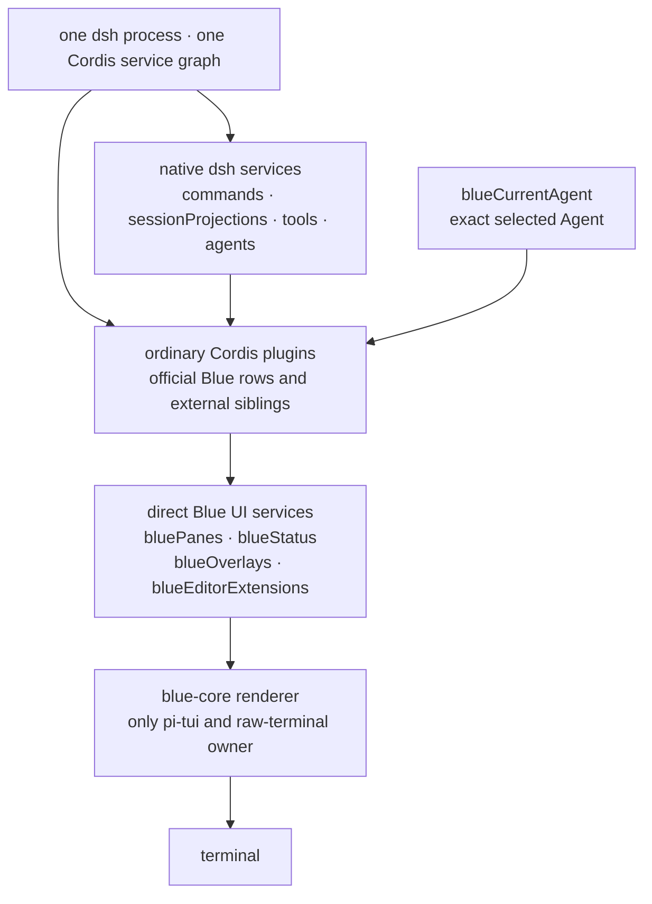

# Blue

[](https://github.com/dsh-blue/blue/actions/workflows/ci.yml)
[](#usage)
[](#usage)
[](LICENSE)
[](https://dsh-blue.dev/en/)
[](https://github.com/dsh-blue/blue/issues/106)

English | [中文](README.zh.md)

Blue is an interactive terminal UI for
[DeepSeek Harness](https://github.com/deepseek-ai/deepseek-harness) (`dsh`).
It is an out-of-tree Cordis bundle over `dsh-base`, built against Harness
`0.1.2-alpha.3`. Blue `0.2.0-alpha.1` deliberately uses the same plugin
model as dsh Web: plugins are ordinary Cordis siblings and consume native dsh
services directly.

<p align="center">
  <a href="https://dsh-blue.dev/blue-demo.mp4"></a>
</p>

## Plugin model

A plugin declares the services it needs with `inject`, then uses them from its
Cordis context:

- `ctx.commands`, `ctx.sessionProjections`, `ctx.tools`, and the rest of
  the documented dsh services are used directly.
- `ctx.bluePanes`, `ctx.blueStatus`, `ctx.blueOverlays`, and
  `ctx.blueEditorExtensions` are the only Blue-specific UI contribution
  services.
- `ctx.blueCurrentAgent.current()` returns the exact Agent selected by this
  Blue frontend when an Agent-scoped native service needs it.
- Every registration belongs to the caller's Cordis Fiber. Unloading the
  plugin removes its commands and UI contributions.

There is no Blue plugin manifest, capability negotiation, adapter facade,
private plugin realm, or separate plugin-author CLI. Blue's own features and
external plugins register through the same services.

```ts
import type { Context } from '@deepseek-ai/cordis'
import type {} from '@deepseek-ai/dsh-commands'
import type {} from '@dsh-blue/blue-api'
import { ui } from '@dsh-blue/blue-ui'

export const name = '@acme/build-health'
export const inject = ['commands', 'bluePanes']

export function apply(ctx: Context): void {
  ctx.commands.register({
    name: 'health',
    description: 'Show build health',
    handler: () => ({ kind: 'success', text: 'healthy' }),
  })
  ctx.bluePanes.register({
    id: 'acme.build-health',
    placement: 'right',
    narrow: 'bottom',
    render: () => ui.text('healthy'),
  })
}
```

## Usage

Prerequisites are Node `^22.19 || >=24` and pnpm 11.

```sh
npm i -g @deepseek-ai/dsh
dsh plugin --profile blue add @dsh-blue/blue@alpha
dsh --profile blue
```

Or install the standalone launcher, which includes the tested dsh runtime:

```sh
npm i -g @dsh-blue/blue-cli@alpha
blue
```

Set `DEEPSEEK_API_KEY` before first run. `/help` lists the active commands
and key bindings.

## Architecture

<!-- BEGIN diagram:blue-layers -->
<!-- single source 单一来源: docs/diagrams/blue-layers.en.mmd — edit the .mmd, then `pnpm run diagrams:sync` -->

<!-- END diagram:blue-layers -->

Only `packages/core` imports pi-tui or owns raw terminal behavior. The API and
UI packages define renderer-neutral nodes and direct registries. App selects
the current Agent and coordinates startup, while transcript and interaction
consume native dsh services and publish UI contributions.

See [the architecture](docs/blue-architecture.md), [the service seams](docs/blue-seams.md),
and the [developer manual](https://dsh-blue.dev/en/plugins/).

## Community

Questions, feedback, or feature ideas? Join the official Blue group on Feishu (primarily Chinese). Invite links expire every 7 days — grab the current one from the latest comment of the pinned [group issue](https://github.com/dsh-blue/blue/issues/106). Bug reports still belong in [issues](https://github.com/dsh-blue/blue/issues).

## License

[MIT](LICENSE).
