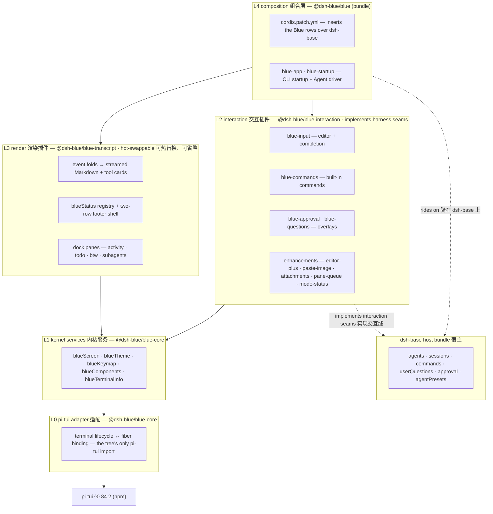
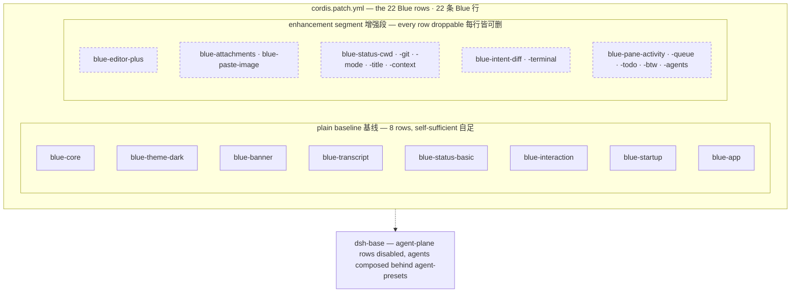

# Blue

[](https://github.com/dsh-blue/blue/actions/workflows/ci.yml)
[](#快速开始)
[](#快速开始)
[](LICENSE)
[](https://dsh-blue.dev/)

[English](README.md) | 中文

Blue 是 [DeepSeek Harness](https://github.com/deepseek-ai/deepseek-harness)（`dsh`）的一个交互式终端 UI（TUI）插件：以 out-of-tree [Cordis](https://www.npmjs.com/package/@deepseek-ai/cordis) 插件 bundle 的形式、骑在 `dsh-base` bundle 之上的 `pi-tui` 渲染器。它的核心主张：**TUI 不是一个包——而是一棵 Cordis 插件树。** 每个渲染组件、交互 provider、命令、状态栏条目都是独立插件，各有自己的 fiber 生命周期，可热替换、可省略。

本仓库是 `@dsh-blue` scope 下五个 workspace 包的独立 home，它们从 `deepseek-harness` monorepo 抽出（原 `packages/blue/*` 与 `packages/bundle/blue`），现按 npm 上发布的 harness（`0.1.1-rc.2` 线）与 vendored Cordis 构建测试。

<!-- TODO: 演示动图——录一段真实会话（vhs / asciinema；贡献者指南（开发手册）里的
     script(1) 冒烟检查是种子），导出 GIF 到 docs/assets/ 后嵌到这里。
     TUI 仓库的 README 成败系于演示。 -->

## 目录

- [快速开始](#快速开始)
- [功能](#功能) — [键位](#键位) · [Slash 命令](#slash-命令)
- [设计哲学](#设计哲学)
- [分层架构](#分层架构)
- [Editor 缝速览](#editor-缝速览)
- [开发](#开发)
- [文档](#文档)
- [与 deepseek-harness 的关系](#与-deepseek-harness-的关系)
- [许可证](#许可证)

## 快速开始

> [!NOTE]
> `0.1.0-rc.6` 为预览版，发布在 **`rc` dist-tag** 下——`latest` 留给稳定线，安装 spec 需带 `@rc` 后缀。

前置：Node `^22.19 || >=24` 与 pnpm 11（两条安装路径都需要：宿主的 `plugin` 命令把安装转发给 pnpm——若缺失，首次运行 `blue` 会以一行报错指明装法：`npm i -g pnpm` 或 `corepack enable pnpm`）。壳包请用 **npm 安装，不要用 pnpm**——pnpm 的严格全局布局不会链接嵌套宿主的依赖，启动时以 `ERR_MODULE_NOT_FOUND` 失败。全局 `dsh` CLI 仅「dsh 直装」路径需要——壳包自带钉版宿主。

### npm 安装

**推荐：`blue` 壳包**（一条命令，自带与测试线一致的 dsh 宿主；首次运行自动把 Blue 装进 `blue` profile）：

```sh
npm i -g @dsh-blue/blue-cli@rc
blue
```

首次运行 `blue` 会在 profile 内下载完整依赖树——数百个包，慢速网络下需要数分钟（预算约 20 分钟，中途超时重跑 `blue` 即从缓存续传）。npm 自身的安装在解析依赖树的大部分时间里没有输出——这种安静是正常现象，不是卡死。

国内网络建议配置镜像加速（profile 内装配与 `/update` 走同一份 registry 配置）：

```sh
pnpm config set registry https://registry.npmmirror.com
```

**或 dsh 直装**（宿主自理，适合已有 dsh 的用户）：

```sh
npm i -g @deepseek-ai/dsh
dsh plugin --profile blue add @dsh-blue/blue@rc
dsh --profile blue
```

安装完成后，启动与首次运行见[快速上手](https://dsh-blue.dev/guide/)；模型、Provider、主题与 API 密钥的配置见[配置教程](https://dsh-blue.dev/guide/config/)。

`@rc` 后缀是必须的：预览版只打 `rc` dist-tag，裸 spec 解析 `latest`、什么都找不到。升级到更新的预览版：壳包用户重跑 `npm i -g @dsh-blue/blue-cli@rc`（重装即升级——壳按自身版本校准 profile）；dsh 直装用户在 Blue 中输入 `/update`（应用内安全升级，详见[FAQ](https://dsh-blue.dev/guide/faq/)）或重跑同一条 `plugin add`。

## 功能

- **流式会话记录** —— 用户/助手消息边流式边渲染 Markdown；工具调用渲染为卡片，默认 generic 呈现，diff（`intent-diff`）与终端输出（`intent-terminal`）有专属卡片。
- **输入编辑器** —— 圆角框编辑器：slash 命令模糊补全、参数幽灵提示、`!` bash 模式、`@` 文件补全、`#` 技能补全、Ctrl-V 剪贴板贴图。
- **Overlay** —— 四选项审批面板（session 级"总是允许"继承）与 tab 化用户问卷 overlay。
- **两行状态栏** —— 模型名、会话模式徽标、git 分支、上下文占用 `ctx N`；条目是注册表贡献，不是写死的。
- **底部 dock 面板** —— agent 运行中的活动 spinner、排队消息、todo 列表、fork 当前会话的 `/btw` 旁路问答面板、子代理分组面板。
- **主题** —— `/theme` 实时预览选择面板与热切换：`dark` / `light` / `ocean` / `paper` / `auto`（OSC 11 背景探测）/ `custom`（JSON 调色板）。
- **天然可扩展** —— 命令、状态栏条目、编辑器增强都经下游插件同款的缝注册；补全菜单与 `/help` 反映实时注册表。

面向用户的功能指南在文档站：[dsh-blue.dev/features](https://dsh-blue.dev/features/)（中文）· [dsh-blue.dev/en/features](https://dsh-blue.dev/en/features/)（English）。

### 键位

`/help` overlay 实时列出所有已注册键位——它才是权威来源：

| 键 | 作用 |
| --- | --- |
| `Shift+Tab` | 循环会话模式：normal → plan → yolo（`/yolo` 自动放行工具审批，提问照常弹） |
| `Ctrl-C` | 清空草稿 → 打断 agent；1 秒内再按一次退出 |
| `Ctrl-S` | 用草稿内容 steer 当前运行中的回合 |
| `Ctrl-V` | 粘贴剪贴板图片为 `[image #N]` 标记 |
| `Ctrl-O` | 展开/折叠最近 3 回合的工具输出与思考块 |
| `Ctrl-T` | 折叠/展开 todo 面板 |
| `↑`（空编辑器） | 召回最近一条排队消息 |

编辑器内，前缀 `/` `!` `@` `#` 分别触发命令、bash、文件、技能补全；行内任意位置的 `#name` 标记在提交时重写为上游 `/name` 技能手势。

### Slash 命令

全部命令自动进入编辑器补全菜单；`/help` 是实时真相：

| 命令 | 别名 | 说明 |
| --- | --- | --- |
| `/quit` | `/q` `/exit` | 退出 Blue |
| `/new` | `/clear` | 开始新会话 |
| `/fork` | — | 把当前会话 fork 成新会话 |
| `/sessions` | `/resume` | 列出持久化会话并切换；带 id 直接恢复 |
| `/btw` | — | 旁路提问：fork 当前会话发问 |
| `/help` | — | 显示可用命令与键位 |
| `/model` | — | 切换会话模型（无参数打开选择器） |
| `/effort` | `/thinking` | 切换当前模型的思考力度 |
| `/provider` | — | 列出 provider、切换路由或新增 |
| `/preset` | — | 列出 agent 预设或切换（仅空会话） |
| `/yolo` | `/yes` | 开关工具调用自动放行 |
| `/tools` | — | 列出当前会话可见的工具 |
| `/mcp` | — | 浏览宿主连接的 MCP 服务器（只读） |
| `/skills` | — | 列出可用技能（`#` 前缀调用） |
| `/theme` | — | 切换配色主题 |
| `/init` | — | 分析代码库并写 `AGENTS.md` |
| `/status` | — | 显示会话头、模型与上下文状态 |
| `/context` | — | 显示 token 用量与上下文窗口 |
| `/version` | — | 显示 Blue 与 harness 版本及实时模型 |
| `/export` | — | 把当前会话导出为 Markdown 文件 |
| `/copy` | — | 复制最近一条助手消息到剪贴板 |

## 设计哲学

**TUI 不是一个包，而是一棵 Cordis 插件树。** pi 自家的 coding agent 把它的 pi-tui UI 收成了一个 6.5k 行的 `InteractiveMode` 上帝类。Blue 的核心主张恰恰相反：

- **Everything is a plugin** —— 渲染组件、交互 provider、命令、状态栏条目都是独立插件，各有自己的 fiber 生命周期。
- **注册即 effect** —— 组件挂载、provider 注册、键位注册全部经 `ctx.effect`/`ctx.on` 绑定，插件卸载自动回滚；HMR 和会话切换是免费的。
- **能力缝三角色** —— 每项能力拆成 definition / provider / consumer。Blue 消费 harness 的缝（`agents`、`sessions`、`commands`、`userQuestions`、审批），也向下游开自己的缝（[docs/blue-seams.md](docs/blue-seams.md)）。
- **依赖推导加载** —— 插件 `inject` 所需服务，不齐就等待；provider 热替换时依赖方自动 unload/reload。
- **plain-first**（ADR D21）—— 每个非平凡表面 = 缝 + plain 默认实现。Blue 自家增强与下游插件经同一条缝注册；拔掉全部增强行的 bundle 仍能启动、可用。
- **全树唯一 pi-tui import** —— 只有 `packages/core` import `@earendil-works/pi-tui`。pi-tui 的破坏性变更传导不出 L0，任何契约都不出现 pi-tui 类型。

完整架构文档见 [docs/blue-architecture.md](docs/blue-architecture.md)；决策记录见 [docs/blue-decisions.md](docs/blue-decisions.md)。

## 分层架构

<!-- BEGIN diagram:blue-layers -->
<!-- single source 单一来源: docs/diagrams/blue-layers.mmd — edit the .mmd, then `pnpm run diagrams:sync` -->

<!-- END diagram:blue-layers -->

依赖严格单向：`core ← transcript / interaction ← app ← bundle`。

| 包 | 层 | 职责 |
| --- | --- | --- |
| [`@dsh-blue/blue-core`](packages/core) | L0 + L1 | 全树唯一 `@earendil-works/pi-tui` 适配器：终端生命周期 + `blueScreen` / `blueTheme` / `blueKeymap` / `blueComponents` / `blueTerminalInfo` 服务。 |
| [`@dsh-blue/blue-interaction`](packages/interaction) | L2 | 输入编辑器、slash 命令、审批与提问 overlay、排队消息面板，以及增强子路径插件（bash 模式、贴图、附件）。 |
| [`@dsh-blue/blue-transcript`](packages/transcript) | L3 | 会话事件折叠为 transcript 项并渲染（流式 Markdown、工具卡片）、`blueStatus` 注册表与 footer 壳、dock 面板（activity / todo / `/btw` / 子代理分组）。 |
| [`@dsh-blue/blue-app`](packages/app) | L4 | 命令行启动（`[task]`、`--resume <id>`）与发布 `blueSession` 的 Agent 驱动。 |
| [`@dsh-blue/blue`](packages/bundle/blue) | L4 | 可安装 bundle：`cordis.patch.yml` 在 `dsh-base` 之上插入 Blue 插件行。 |
| [`@dsh-blue/blue-cli`](packages/cli) | — | `blue` 启动壳：插件树之外的独立全局命令——钉住 dsh 宿主、把 `blue` profile 校准到自身版本、翻译参数（`-V` / `plugin` 子命令 / 吞没 `--profile`）。 |

每个入口都是 Cordis 插件形态（`export const name`、可选 `inject`、`apply(ctx)`）；Cordis 与 dsh 服务包是 `peerDependencies`，由宿主 `dsh` 安装提供。壳是唯一例外：它从不进入 dsh 树内加载。

**同一棵树，换成 bundle 视角。** `cordis.patch.yml` 分三段插入 23 条 Blue 行。plain 基线（基线段 + 组装段，共 8 行）自足可跑；增强段的每一行——整个虚线段——都可单独删掉，这就是 plain-first（ADR D21）的图景：

<!-- BEGIN diagram:blue-composition -->
<!-- single source 单一来源: docs/diagrams/blue-composition.mmd — edit the .mmd, then `pnpm run diagrams:sync` -->

<!-- END diagram:blue-composition -->

Dock 顺序即插件行序——activity → queue → todo → btw → 子代理分组，编辑器最后挂载。宿主的 agent 面（工具、plan 模式……）被进程级禁用、按 agent 在预设后面重新组合（ADR D37 薄宿主）；`/preset` 切换组合。

## Editor 缝速览

输入编辑器用四个角色走通整套哲学，层间没有捷径：

- **契约（L1）**——`BlueEditor` 是 `packages/core/src/types.ts` 里的接口，刻意不含任何 pi-tui 类型、任何 harness 类型。
- **实现（L0）**——获得编辑器的唯一入口是 `ctx.blueComponents.createEditor()`；core 内部的适配器包装 pi-tui `Editor`，是唯一知道背后是 pi-tui 的代码。未来的 vim 模式编辑器可以实现同一接口，消费者毫无感知。
- **消费（L2）**——`blue-input` 插件创建并挂载编辑器，经共享编辑器缝发布，后挂插件无论行序如何都能找到它。
- **增强（L2 子路径插件）**——`blue-editor-plus`（bash 模式、补全 provider）与 `blue-paste-image`（Ctrl-V 贴图标记）是 `cordis.patch.yml` 里的行：单独删掉任一行，plain 编辑器照常工作。

带代码的完整走查见 [docs/blue-editor-walkthrough.md](docs/blue-editor-walkthrough.md)；Blue 开的每条缝、契约与 plain 默认的完整清单见 [docs/blue-seams.md](docs/blue-seams.md)。

## 开发

```sh
pnpm run test           # vitest：单元套件 + bundle 的全树 e2e
pnpm run test:coverage  # packages/*/src 逐文件 100% 覆盖率门禁
pnpm run build          # tsc -b 产 lib/types，tsdown 打包 lib/
pnpm run lint           # oxlint
pnpm run typecheck      # tsc -b
```

测试从源码跑：spec 经相对 `../src/*.ts` 路径 import 被测包，所有 `@deepseek-ai/*` 依赖从 `node_modules` 解析。

本地开发安装（从源码检出、link 安装）与迭代环在文档站的贡献者指南：[dsh-blue.dev/plugins/contributing](https://dsh-blue.dev/plugins/contributing/)（English: [dsh-blue.dev/en/plugins/contributing](https://dsh-blue.dev/en/plugins/contributing/)）。

## 文档

**面向用户的文档**在文档站：<https://dsh-blue.dev/>（中文）· <https://dsh-blue.dev/en/>（English）。下方设计文档仍仅在仓库内。

**设计文档**（中文）在 [docs/](docs/)；在用/存档索引见 [docs/README.md](docs/README.md)：

- [docs/blue-architecture.md](docs/blue-architecture.md) —— 架构：哲学、L0–L4 分层、稳定性规则。
- [docs/blue-seams.md](docs/blue-seams.md) —— 缝清单：Blue 开的每条缝（契约、plain 默认），以及 harness 侧每个视觉表面由哪个 Blue 插件实现。
- [docs/blue-editor-walkthrough.md](docs/blue-editor-walkthrough.md) —— Editor 缝实例走查：四角色，含代码。
- [docs/blue-decisions.md](docs/blue-decisions.md) —— 决策记录（ADR）。
- [docs/blue-roadmap.md](docs/blue-roadmap.md) 与 [blue-commands-plan.md](docs/blue-commands-plan.md) —— 路线图，以及内置命令实施清单（四家参照系合并、能力矩阵、分期）。
- [AGENTS.md](AGENTS.md) 与各包自带的 `AGENTS.md` —— 当前代码的权威描述（仓库级约定在根文件；包级实现细节在 `packages/*/AGENTS.md`）。

已归档的各阶段设计与调研（MVP、P1、P2、pi-tui/harness 选型）在 [docs/history/](docs/history/)。

## 与 deepseek-harness 的关系

- 运行时与测试依赖（`@deepseek-ai/cordis` 4.0.1、`@deepseek-ai/dsh-*` 0.1.1-rc.2、`@earendil-works/pi-tui` ^0.84.2）来自 npm registry；Blue 自身五包未发布，在本仓保持 workspace 链接。
- harness 仓库的门禁（文档 i18n 配对、README 门禁、snapshot/e2e 车道）不适用于本仓库；本仓保留构建、全量测试套件与逐文件 100% src 覆盖率门禁。

## 许可证

[MIT](LICENSE)。`@dsh-blue` scope 下每个包的 `license` 字段均为 MIT。
