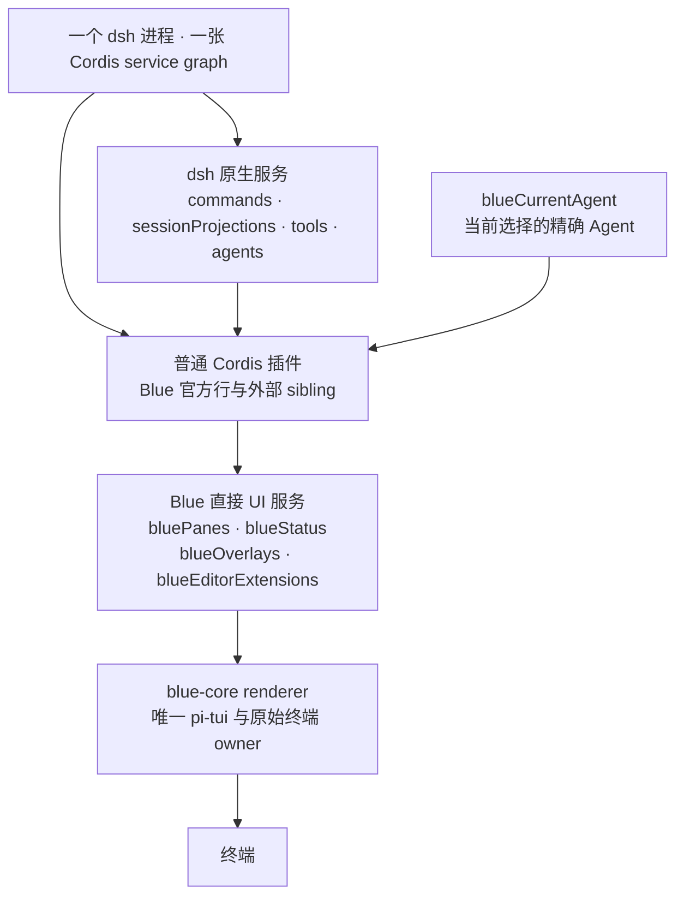

# Blue

[](https://github.com/dsh-blue/blue/actions/workflows/ci.yml)
[](#用法)
[](#用法)
[](LICENSE)
[](https://dsh-blue.dev/)
[](https://github.com/dsh-blue/blue/issues/106)

[English](README.md) | 中文

Blue 是 [DeepSeek Harness](https://github.com/deepseek-ai/deepseek-harness)
（`dsh`）的交互式终端界面。它是叠加在 `dsh-base` 上的树外 Cordis
bundle，针对 Harness `0.1.2-alpha.3` 构建。Blue `0.2.0-alpha.1`
刻意与 dsh Web 使用同一种插件模型：插件是普通 Cordis sibling，直接消费
dsh 原生服务。

<p align="center">
  <a href="https://dsh-blue.dev/blue-demo.mp4"></a>
</p>

## 插件模型

插件通过 `inject` 声明服务，然后直接从 Cordis context 使用：

- `ctx.commands`、`ctx.sessionProjections`、`ctx.tools` 以及其他有文档的
  dsh 服务直接复用，不经过 Blue 适配。
- `ctx.bluePanes`、`ctx.blueStatus`、`ctx.blueOverlays` 与
  `ctx.blueEditorExtensions` 是仅有的 Blue 专属 UI 贡献服务。
- Agent-scoped 原生服务需要当前对象时，通过
  `ctx.blueCurrentAgent.current()` 获取这个 Blue frontend 当前选择的精确
  Agent。
- 每次注册都属于调用方的 Cordis Fiber；插件卸载会移除命令和 UI 贡献。

Blue 不再有专用插件 manifest、能力协商、适配 facade、私有插件域或独立的
插件作者 CLI。Blue 官方功能与外部插件注册到完全相同的服务。

```ts
import type { Context } from '@deepseek-ai/cordis'
import type {} from '@deepseek-ai/dsh-commands'
import type {} from '@dsh-blue/blue-api'
import { ui } from '@dsh-blue/blue-ui'

export const name = '@acme/build-health'
export const inject = ['commands', 'bluePanes']

export function apply(ctx: Context): void {
  ctx.commands.register({
    name: 'health',
    description: 'Show build health',
    handler: () => ({ kind: 'success', text: 'healthy' }),
  })
  ctx.bluePanes.register({
    id: 'acme.build-health',
    placement: 'right',
    narrow: 'bottom',
    render: () => ui.text('healthy'),
  })
}
```

## 用法

前置条件为 Node `^22.19 || >=24` 与 pnpm 11。

```sh
npm i -g @deepseek-ai/dsh
dsh plugin --profile blue add @dsh-blue/blue@alpha
dsh --profile blue
```

也可以安装包含已测试 dsh runtime 的独立启动器：

```sh
npm i -g @dsh-blue/blue-cli@alpha
blue
```

首次运行前设置 `DEEPSEEK_API_KEY`。`/help` 会列出当前有效的命令和键位。

## 架构

<!-- BEGIN diagram:blue-layers -->
<!-- single source 单一来源: docs/diagrams/blue-layers.zh.mmd — edit the .mmd, then `pnpm run diagrams:sync` -->

<!-- END diagram:blue-layers -->

只有 `packages/core` 可以导入 pi-tui 或处理原始终端行为。API/UI 包定义
renderer-neutral 节点和直接 registry；app 选择当前 Agent 并协调启动；
transcript 与 interaction 消费 dsh 原生服务并发布 UI 贡献。

进一步阅读：[架构](docs/blue-architecture.md)、[服务 seam](docs/blue-seams.md)、
[开发手册](https://dsh-blue.dev/plugins/)。

## 社区

欢迎加入 Blue 官方飞书群——反馈、排障、功能讨论与版本动态的第一线。入群链接 7 天过期，请从置顶的[群组 issue](https://github.com/dsh-blue/blue/issues/106) 最新评论获取当前链接；bug 仍请通过 [issue](https://github.com/dsh-blue/blue/issues) 提交追踪。

## 许可证

[MIT](LICENSE)。
