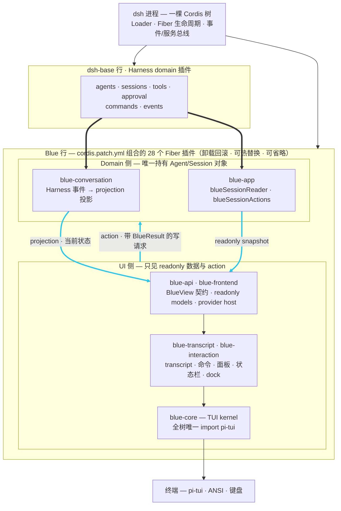

# Blue

[](https://github.com/dsh-blue/blue/actions/workflows/ci.yml)
[](#用法)
[](#用法)
[](LICENSE)
[](https://dsh-blue.dev/)

[English](README.md) | 中文

Blue 是 [DeepSeek Harness](https://github.com/deepseek-ai/deepseek-harness)（`dsh`）的交互式终端界面（TUI）：一个 `pi-tui` 渲染器，以树外 [Cordis](https://www.npmjs.com/package/@deepseek-ai/cordis) 插件 bundle 的形式挂载在 `dsh-base` bundle 之上。本仓库包含十四个 workspace 包——十个属于 `0.1.0-rc.8` 发布集，四个为 validation-only adapter——针对已发布的 Harness `0.1.1-rc.2` 线构建与测试。

<p align="center">
  <video src="https://github.com/dsh-blue/blue/raw/master/website/public/blue-demo.mp4" width="720" autoplay loop muted playsinline controls></video>
</p>
<p align="center"><i>Blue 实拍：流式回复、工具卡片与底部 dock 面板——<a href="https://github.com/dsh-blue/blue/raw/master/website/public/blue-demo.mp4">观看演示视频</a>。</i></p>

## 设计哲学

**TUI 不是一个包，而是一棵 Cordis 插件树。** 每个渲染组件、交互 provider、命令和状态条目都是独立的插件，拥有自己的 Fiber 生命周期：可以随意热替换、可以省略。

- **注册即副作用**——组件挂载、provider 注册、键位绑定都通过 `ctx.effect`/`ctx.on` 绑定，插件卸载即全部回滚；HMR 和会话切换因此免费获得。
- **依赖推导加载**——插件通过 `inject` 声明所需服务并等待其就位；provider 热替换会自动卸载并重载它的依赖方。
- **plain 优先**——每个非平凡表面都是一条缝加一个 plain 默认实现。Blue 自己的增强与下游插件走同一批缝注册；删掉全部增强行的 bundle 依然能启动、能工作。
- **唯一的 pi-tui 入口**——只有 `packages/core` 引入 `@earendil-works/pi-tui`，任何公开契约都不出现 pi-tui 类型。

完整论述见 [docs/blue-architecture.md](docs/blue-architecture.md)；决策记录（ADR）见 [docs/blue-decisions.md](docs/blue-decisions.md)。

## 用法

> [!NOTE]
> `0.1.0-rc.8` 是预览版，发布在 **`rc` dist-tag** 下——安装 spec 需要带 `@rc` 后缀；升级就是再跑一遍同样的命令。

前置条件：Node `^22.19 || >=24`、pnpm 11、`dsh` CLI ≥ `0.1.1-rc.2`。

```sh
npm i -g @deepseek-ai/dsh
dsh plugin --profile blue add @dsh-blue/blue@rc
dsh --profile blue
```

或者安装独立的 `blue` 启动器——它内置钉住的 dsh 宿主并自行管理 `blue` profile：

```sh
npm i -g @dsh-blue/blue-cli@rc
blue
```

首次运行前设置 `DEEPSEEK_API_KEY`。键位与 slash 命令以 `/help` 的实时清单为准，文档见[键位参考](https://dsh-blue.dev/reference/keys/)与[命令参考](https://dsh-blue.dev/reference/commands/)；[快速上手](https://dsh-blue.dev/guide/)带你完成首次运行，[配置指南](https://dsh-blue.dev/guide/config/)覆盖 provider、模型与主题。

## 架构

<!-- BEGIN diagram:blue-layers -->
<!-- single source 单一来源: docs/diagrams/blue-layers.mmd — edit the .mmd, then `pnpm run diagrams:sync` -->

<!-- END diagram:blue-layers -->

运行时流向为 `Harness domain -> projection/action 边界 -> renderer-neutral model -> TUI 功能插件 -> core`。事件表达已发生的事实，projection 表达当前状态，action 是带结构化结果的写请求；Blue 不维护第二套 Agent 真相，Agent/Session 对象也从不越界进入 renderer。bundle 的逐行组合（`dsh-base` 之上的 28 行 Blue 自有插件）见 [bundle 指南](https://dsh-blue.dev/plugins/builtins/)，功能巡览见[网站功能页](https://dsh-blue.dev/features/)。

## 文档

- **用户手册**——[快速上手](https://dsh-blue.dev/guide/) · [功能](https://dsh-blue.dev/features/) · [键位与命令参考](https://dsh-blue.dev/reference/commands/)（English: [guide](https://dsh-blue.dev/en/guide/) · [features](https://dsh-blue.dev/en/features/) · [reference](https://dsh-blue.dev/en/reference/commands/)）
- **开发手册**——[编写插件](https://dsh-blue.dev/plugins/) · [Seam 参考](https://dsh-blue.dev/plugins/seams/) · [贡献指南](https://dsh-blue.dev/plugins/contributing/)
- **Harness 手册**——[dsh 概念、profile、工具、MCP](https://dsh-blue.dev/dsh/)
- **设计文档**（仓库内部）——living/archived 索引见 [docs/README.md](docs/README.md)；仓库级约定见 [AGENTS.md](AGENTS.md) 与各包自己的 `AGENTS.md`。

## 许可证

[MIT](LICENSE)。`@dsh-blue` 作用域下的每个包都声明 `license: MIT`。
