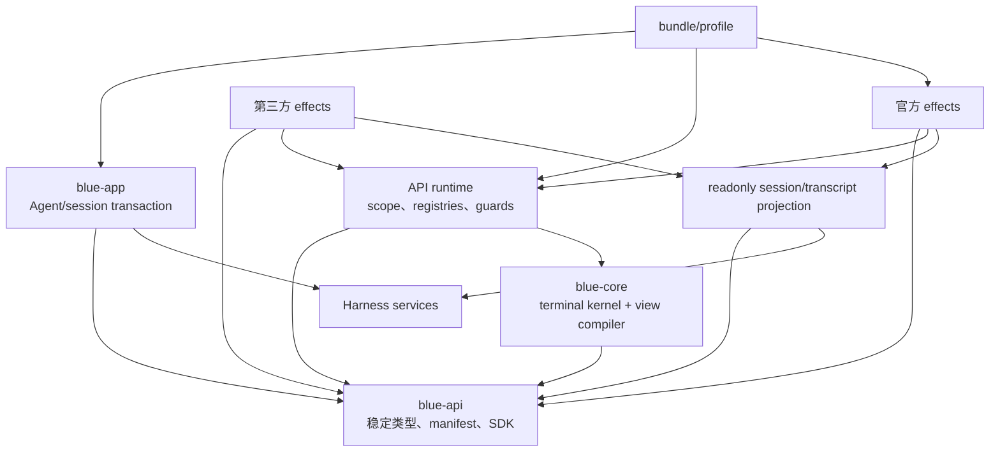
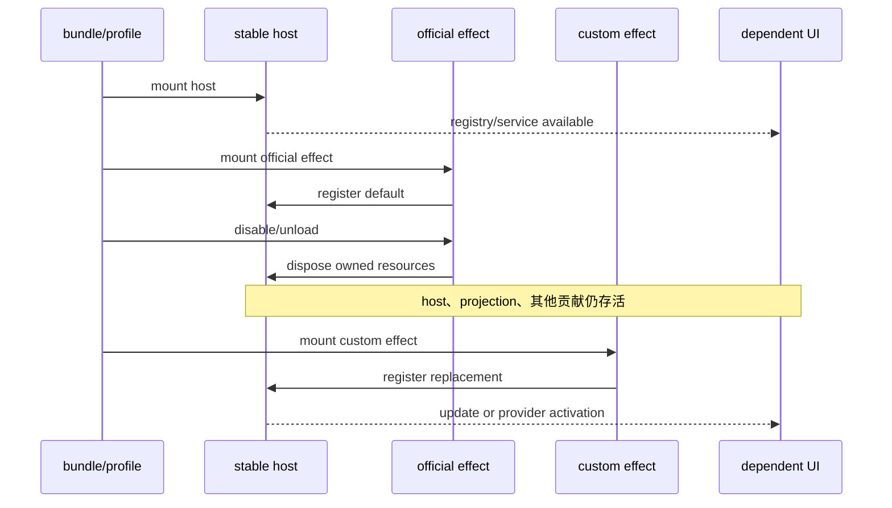

# Blue 公共 API 与可替换 UI 改进设计

> 状态：目标架构设计，Phase A 可实施。本文是 [架构审计](./blue-architecture-audit.md) 的实施正典；审计保留证据与评价，本文规定目标、契约、迁移顺序和验收条件。当前已落地的内部缝仍以 [blue-seams.md](./blue-seams.md) 为准。
>
> 适用窗口：Blue `0.1.0-rc.1` 之后、公共 API v1 冻结之前。Blue 仍处于 RC，允许一次性关闭意外暴露的源码入口、迁移契约所有权和调整 bundle 粒度；v1 发布后执行本文的兼容政策。

## 1. 决策摘要

Blue 不需要重写。现有 Cordis 插件树、唯一 pi-tui adapter、effect-bound 注册、plain-first、width contract 和真实进程测试全部保留。改进集中在四点：

1. 新增叶子契约包 `@dsh-blue/blue-api`，公共类型不再由 app、transcript 或其他默认实现拥有；
2. 分离 stable seam host、官方默认效果和 bundle composition，使卸载效果不连带销毁 registry 或数据面；
3. 官方可扩展 UI 成为公共 API 的第一批消费者，以同一协议验证能力、复用和防护；
4. 收敛 session observation、panel orchestration、command scope 和 stateful renderer shell 四类流程重复，不为追求复用合并不同领域语义。

公共 API 继续基于 Cordis，不另造插件管理器。Cordis 负责 Fiber、依赖激活和卸载；Blue 负责 consumer scope、公共协议、声明式 view 编译、资源预算和错误隔离。同进程 Cordis 插件不是安全沙箱。

Phase A 只建立契约地基并修正依赖，不改变用户可见 UI，也不发布无法使用的半成品 `bluePlugins` runtime。Phase B 建立宿主；后续 surface 只有在官方实现完成 dogfood 后才进入 Stable。

## 2. 目标、非目标与不变量

### 2.1 目标

- 第三方只依赖 `blue-api` 与 Cordis 即可声明兼容范围并贡献受支持的效果；
- Stable API 在同一 major 内保持源码及已承诺行为兼容；
- 用户能用稳定 bundle row id 禁用官方效果，再挂实现同一 seam 的插件；
- 卸载插件时，其 contribution、订阅、异步任务、panel 和 notification 全部回收；
- 插件返回结构化数据，Blue 继续拥有布局、主题、宽度、焦点与最终渲染；
- 官方与第三方复用同一 registry、view compiler、observer 和 orchestration 基础设施；
- 单个正常插件的错误不终止 terminal frame、输入链或 Agent。

### 2.2 非目标

- 不防御恶意 npm 包；它仍可访问进程、写 stdout 或阻塞 event loop；
- 不开放 raw terminal、frame clamp、session switch commit 或 approval 安全策略；
- 不兼容当前 `./src/*`、`BlueComponent`、`blueScreen`、mutable Agent/Session 或未标 Stable 的 subpath；
- v1 不支持任意 ANSI、原始按键监听或完整 editor replacement；
- 不复制 Harness 已有的 commands、tools、sessions 等权威 registry；
- 不因两处代码形似就合并不同领域流程。

### 2.3 不变量

1. core 仍是唯一导入 pi-tui、接触 raw terminal、提供宽度真值的包；
2. 每项注册属于调用方 Fiber，卸载作用域自动且幂等撤销注册；
3. Stable 签名只含 Blue 自有 readonly 数据，不携带实现类和可变 Harness 对象；
4. Blue 编译第三方 view，并在出口执行宽度、控制字符、大小和错误约束；
5. provider 只拥有一个窄 surface，无关 registry/controller/projection 不随默认 provider 卸载；
6. 官方效果与第三方同权使用稳定 seam，不保留绕过公共 guard 的快捷路径；
7. Harness registry 仍是业务能力的单一真相；
8. API host 是稳定基础设施，不包含默认视觉策略。

## 3. 依赖与契约所有权

### 3.1 当前问题

名义方向是 `core <- transcript / interaction <- app <- bundle`，实际还有：transcript 为 `blueSession` declaration merge 依赖 app；interaction 为 session/model contract 依赖 app，为 fold、status 和 `BLUE_VERSION` 依赖 transcript；transcript 又同时拥有 fold、默认 renderer、`blueStatus` 和 `blueIntents` host；一个 `blue-interaction` 父 row 挂载 input、commands、questions、approval、title 等多项责任。

这些关系没有形成运行时循环，但实现包拥有共享 contract，导致“替换实现”与“保留 seam”冲突。卸载默认 transcript 会让 status/intents 贡献者失去 host；卸载 interaction 无法只替换 editor 或 approval。

### 3.2 目标依赖



最终 `blue-api` 是叶子：不依赖 core、transcript、interaction、app、pi-tui 或具体 dsh service 包。它可依赖 Cordis 类型和标准 semver parser；运行时代码只限 manifest validation、版本检查和 `defineBluePlugin()`，无 I/O 或全局状态。

### 3.3 所有权表

| 内容 | 目标所有者 | 等级 | 理由 |
|---|---|---|---|
| manifest、API range、capability | blue-api | Stable | 激活前可读取检查 |
| readonly session/model/tool snapshots | blue-api | Stable | 隔离 Harness mutable object |
| `BlueView`、inline、panel model | blue-api | Stable | renderer-independent 协议 |
| consumer-scoped façade | API 类型 + runtime 实现 | Stable | 第三方唯一入口 |
| `BlueComponent`、`BlueComponents` | core | Internal | pi-tui adapter contract |
| mutable transcript items | transcript | Internal | streaming/cache 实现状态 |
| `foldSessionEvents()` | transcript 正式 subpath | Experimental | 有 export 消费者，但不是插件协议 |
| AgentHandle、switch queue | app | Internal | session transaction 所有权 |
| panel component、focus stack | interaction/core | Internal | Blue 必须控制布局焦点 |
| official renderers | effect plugins | Internal | 可替换默认实现 |

Fold 不迁入 `blue-api`：它消费 Harness `SessionEvent`，输出可变 streaming item；迁入会让 API 依赖 Harness 类型并冻结默认 renderer 模型。session export 暂时使用 transcript Experimental subpath，后续转向只读 paged projection API。

## 4. Cordis seam 模型

### 4.1 三种关系

| 需求 | 模式 | 例子 | 替换语义 |
|---|---|---|---|
| 多项并存 | contribution registry | status、command、completion、tool view、dock | 官方和第三方并存；duplicate id 原子失败 |
| 唯一实现 | Cordis service provider | theme、主 transcript renderer、Experimental editor | 禁用旧 provider、挂新 provider；inject 消费者重载 |
| 整组启停/重排 | bundle composition | banner、questions、approval、command family | 以稳定 row id disable/insert |

Theme 不应变成多主题 registry；status 不应为每项声明 Context service。Questions/approval 已是 Harness provider seam，Blue 只拆官方 bundle 地址，并让 UI 使用公共 panel model。

### 4.2 替换时序



宣称“支持替换”必须同时满足：contract 不归默认 provider；host 与 effect 是不同 Fiber；provider 职责窄且消费者用 inject；不应 reload 的 controller 只依赖 host；provider 暂缺有明确空态；官方 row id 和 contribution/provider id 稳定，重复 provider fail loud。

Cordis 提供 Fiber、effect 回收、服务依赖与 `PENDING -> ACTIVE`。Blue 仍须提供调用方 scope 绑定、id/排序规则、readonly snapshot、异步取消、view compiler、资源预算、错误隔离及 composition compatibility。普通 service method 无法推断调用者 Fiber，不能把 disposer 绑到 host 自己的 Context。

## 5. 公共包与宿主

### 5.1 发布面

```text
@dsh-blue/blue-api
  .                 manifest、defineBluePlugin、Stable 类型
  ./experimental    显式 opt-in 的不稳定能力
  ./package.json
```

不发布 `./src/*` 或 internal subpath。若 Phase A 没有真实 Experimental symbol，就不提前发布空入口。

### 5.2 Manifest 与 SDK

```ts
interface BluePluginManifest {
  readonly id: string
  readonly api: string
  readonly capabilities: readonly BlueCapability[]
}

interface BluePluginDefinition {
  readonly manifest: BluePluginManifest
  apply(api: BluePluginApi): void | Promise<void>
}

function defineBluePlugin(definition: BluePluginDefinition): BlueCordisPlugin
```

- `id` 使用 npm scope 或反向域名 namespace；contribution id 以 `${manifest.id}.` 开头；
- `api` 是标准 semver range，如 `^1.0.0`；
- capabilities 用于诊断和限制 façade，不替代 Cordis `inject`；
- manifest 是 plugin 静态只读属性，loader 不执行 apply 即可检查；
- 不兼容在任何注册前拒绝该 Fiber，输出稳定错误码，其他 UI 继续运行。

`defineBluePlugin()` 生成标准 Cordis plugin，声明 `inject = ['bluePlugins']`。它在第三方自己的 `apply(ctx)` 中调用 `ctx.bluePlugins.open(ctx, manifest)`；host 使用传入的 consumer Context effect-bind 每个 disposer。

### 5.3 分域 façade

```ts
interface BluePluginHost {
  readonly version: string
  open(context: Context, manifest: BluePluginManifest): BluePluginApi
}

interface BluePluginApi {
  readonly commands: BlueCommandRegistry
  readonly status: BlueStatusRegistry
  readonly tools: BlueToolViewRegistry
  readonly dock: BlueDockRegistry
  readonly editor: BlueEditorExtensionRegistry
  readonly panels: BluePanelService
  readonly notifications: BlueNotificationService
  readonly session: BlueSessionReader
}
```

`open()` 是 SDK 与 host 的握手，不是常规第三方入口。façade 只包含 manifest 声明的 capability；越权返回 `BLUE_CAPABILITY_DENIED`，不能静默提权。

统一 registry 纪律：配置在 register 时 defensive-copy/freeze；handle 幂等且自动 effect-bound；duplicate id 不覆盖；priority 越小越先，同值按注册序；scope 卸载先 abort 再逆序 dispose；callback 收 readonly snapshot 与 `AbortSignal`；连续失败达到阈值后仅停用该 contribution。

## 6. Stable 契约

### 6.1 通用数据

```ts
interface BlueRegistration {
  readonly disposed: boolean
  dispose(): void
}

interface BlueContributionMeta {
  readonly id: string
  readonly priority?: number
}

type BlueTone = 'default' | 'muted' | 'accent' | 'success' | 'warning' | 'danger'

type BlueCapability =
  | 'commands'
  | 'status'
  | 'tools'
  | 'dock'
  | 'editor'
  | 'panels'
  | 'notifications'
  | 'session.read'
  | 'session.act'

type BlueErrorCode =
  | 'BLUE_API_INCOMPATIBLE'
  | 'BLUE_CAPABILITY_DENIED'
  | 'BLUE_DUPLICATE_ID'
  | 'BLUE_INVALID_CONTRIBUTION'
  | 'BLUE_LIMIT_EXCEEDED'
  | 'BLUE_ABORTED'
  | 'BLUE_SESSION_UNAVAILABLE'
  | 'BLUE_ACTION_REJECTED'

type BlueResult<Value = void> =
  | { readonly ok: true, readonly value: Value }
  | { readonly ok: false, readonly code: BlueErrorCode, readonly message: string }

interface BlueInlineSpan {
  readonly text: string
  readonly tone?: BlueTone
  readonly emphasis?: 'normal' | 'strong'
}
```

公共文本不携带 ANSI formatter、theme function、`render(width)` 或 component lifecycle；控制字符由 host 过滤。

### 6.2 Session

```ts
interface BlueSessionSnapshot {
  readonly id: string
  readonly cwd: string
  readonly status: 'idle' | 'running' | 'waiting' | 'failed'
  readonly mode: 'normal' | 'plan' | 'yolo'
  readonly model?: { readonly id: string, readonly provider?: string, readonly effort?: string }
}

type BlueSessionAction =
  | { readonly kind: 'followup', readonly text: string }
  | { readonly kind: 'steer', readonly text: string }
  | { readonly kind: 'interrupt' }

interface BlueSessionReader {
  current(): BlueSessionSnapshot | null
  subscribe(listener: (snapshot: BlueSessionSnapshot | null) => void): BlueRegistration
  request(action: BlueSessionAction, options?: { readonly signal?: AbortSignal }): Promise<BlueResult>
}
```

`session.read` 只允许 current/subscribe，`session.act` 才允许 request。业务拒绝使用 `BlueResult`，不会把 Harness error object 或 stack 暴露给插件。不开放 Agent、AgentHandle、mutable model ref、session log 或 new/resume/fork transaction。后三项先由官方 command 调 app 内部 service；将来开放须有独立 capability 与结构化结果，不能公开内部事件。

### 6.3 Commands 与 status

Commands 继续注册到 Harness `ctx.commands`，Blue adapter 自动接入 completion/help：

```ts
interface BlueCommand extends BlueContributionMeta {
  readonly name: string
  readonly aliases?: readonly string[]
  readonly description: string
  execute(context: BlueCommandContext, args: readonly string[]):
    BlueResult | Promise<BlueResult>
}

interface BlueCommandContext {
  readonly session: BlueSessionSnapshot | null
  readonly signal: AbortSignal
  readonly notifications: BlueNotificationService
  readonly panels: BluePanelService
  request(action: BlueSessionAction): Promise<BlueResult>
}
```

Context 没有 screen、editor、Agent 或 process exit。内置 name/alias 不能覆盖，late async result 被丢弃。同步 throw/rejection 由 adapter 映射为诊断和 `BLUE_ACTION_REJECTED`，插件不得通过 error message 控制 notification severity。

```ts
interface BlueStatusEntry extends BlueContributionMeta {
  readonly band: 'primary' | 'secondary'
  readonly align: 'start' | 'end'
  readonly minIntervalMs?: number
  render(context: BlueStatusContext): readonly BlueInlineSpan[] | null
}
```

公共 status 不知道 width、不返回 ANSI。host 合并刷新、限制最小间隔，按 band/align/priority 编译、测宽和 first-fit；窄终端先丢低优先级项。

### 6.4 `BlueView` 与 tool view

```ts
type BlueView =
  | { readonly kind: 'text', readonly content: string, readonly tone?: BlueTone }
  | { readonly kind: 'fields', readonly rows: readonly BlueField[] }
  | { readonly kind: 'code', readonly code: string, readonly language?: string }
  | { readonly kind: 'diff', readonly before: string, readonly after: string }
  | { readonly kind: 'sections', readonly sections: readonly BlueSection[] }

interface BlueToolViewProvider extends BlueContributionMeta {
  readonly tools: readonly string[]
  present(snapshot: BlueToolSnapshot): BlueView | null
}

interface BlueField {
  readonly label: string
  readonly value: readonly BlueInlineSpan[]
}

interface BlueSection {
  readonly title?: string
  readonly body: BlueView
  readonly collapsed?: boolean
}

type BlueJson = null | boolean | number | string | readonly BlueJson[] | {
  readonly [key: string]: BlueJson
}

interface BlueToolSnapshot {
  readonly callId: string
  readonly name: string
  readonly status: 'running' | 'succeeded' | 'failed'
  readonly arguments: BlueJson | null
  readonly startedAt: number
  readonly endedAt?: number
  readonly result?: { readonly text: string, readonly truncated: boolean }
}
```

Tool snapshot 只有 call id、name、readonly JSON 参数、状态、时间和受限结果摘要。compiler 统一 theme、wrap/truncate、highlight、折叠、最大行数、cache、错误占位和 eviction。任意组件仅可进入 `./experimental` 的 unsafe capability，要求 profile 显式启用，不在 Stable 兼容或渲染保护承诺内。

### 6.5 Panel、dock 与 notification

Panel 只接受 Select/Form/Info 状态机模型：

```ts
type BluePanelModel =
  | { readonly kind: 'select', readonly title: string, readonly items: readonly BlueSelectItem[] }
  | { readonly kind: 'form', readonly title: string, readonly fields: readonly BlueFormField[] }
  | { readonly kind: 'info', readonly title: string, readonly body: BlueView }

type BluePanelResult =
  | { readonly kind: 'submit', readonly value: BlueJson }
  | { readonly kind: 'cancel', readonly reason: 'user' | 'plugin-unload' | 'session-switch' }

interface BluePanelHandle {
  readonly result: Promise<BluePanelResult>
  update(model: BluePanelModel): BlueResult
  close(): void
}
```

`BlueSelectItem` 只含 id、label、description 和 disabled；`BlueFormField` 首版只含 text、secret、boolean 与单选字段，值均可序列化为 `BlueJson`。Blue 决定 editor-slot/overlay、焦点栈、Escape、尺寸和关闭恢复；插件不能传 `BlueFocusable`。插件卸载时以 `plugin-unload` 关闭全部 panel，late update 返回 `BLUE_ABORTED` 并记录诊断。

Dock v1 只承诺 `above-editor` placement，贡献者返回 `BlueView` 并声明最大行数；Blue 决定 mount order、gutter、行预算与隐藏。Notification 只接受 severity、plain message、duration 与 dedupe key，Blue 决定显示形态。

### 6.6 Editor

Stable v1 只开放 completion provider、submit hook 和 named action：completion 接收 text/cursor snapshot；submit 返回 accept/reject 或结构化 content blocks；action 使用 Blue 校验的 key binding 并返回 handled/pass。每个 async handler 有 timeout、AbortSignal 和结果上限。

Focus、history、draft stash、prompt、editor instance 与完整 replacement 保持 Internal/Experimental。完整 provider 至少有一个非官方消费者、swap 测试和输入法/历史兼容方案后才可另行进入 Stable。

## 7. 官方 UI 重构与复用

### 7.1 迁移矩阵

| 当前 surface | 目标 seam | 官方默认 | 用户替换 |
|---|---|---|---|
| theme | exclusive provider | dark/light/auto/custom | disable 默认 row，挂同 service provider |
| footer status | registry | basic/cwd/git/context/title/mode | 逐 row 禁用并注册自定义 entry |
| tool cards | tool view registry | generic/diff/terminal | 禁用对应 provider 或注册更专匹配 |
| dock panes | dock registry | activity/queue/todo/btw/agents | 逐 row 禁用、插入、重排 |
| banner | bundle effect | official banner | disable row，挂自定义 view effect |
| transcript | provider + stable projection | default renderer | 保留 host/projection，只换 renderer |
| command families | Harness adapter + rows | session/model/tools/preset 等 | 按 family row 替换 |
| editor enhancements | editor registry | plus/paste/skills | 逐 contribution 替换或并存 |
| questions/approval | Harness provider + panel model | 独立官方 providers | disable 独立 row，挂自定义 provider |
| title/cadence | bundle effects | 独立官方 plugins | 分别按稳定 row id 替换 |

完成标准不是“第三方有 façade”。官方 surface 也必须走同一 registry/provider/compiler；若仍直接调用 `blueScreen`、`mountEditorReplacement()`、`getSharedEditor()` 或自行处理 session attach/detach，迁移未完成。

### 7.2 host 与默认 renderer 分离

```text
API runtime                         owns scopes, registries, scheduler, guards
session/transcript projection      owns Agent/events -> readonly snapshots
default transcript renderer        consumes projection + tool views
footer shell                       consumes status registry
```

卸载 default transcript 后，projection、status/tool registries 和已有 contributions 继续存在。footer 是否显示取决于 shell 是否保留，不取决于 registry 是否幸存。

### 7.3 拆分 interaction composition

保留 interaction 实现包，通过稳定 subpath 和 bundle row 拆出 input/editor、各 command family、questions、approval、terminal title、session-title cadence、editor enhancements 和 panes。每个 row 只挂一个可独立卸载的顶层 Fiber。可保留聚合入口作为便捷 preset，但不能是唯一装配地址。

### 7.4 复用治理

成熟抽象继续保留：width/chrome 是唯一宽度真值；`BlueComponents` 是 view compiler 后端；Select/Info/Form panels 是公共 panel renderer；fold 继续服务 replay/live/export；registry/disposer 是 public registry kernel；plain-first 是 replacement 测试基础。

新增四个 Internal 复用层：

1. `SessionObserver<T>`：snapshot、seq fence、增量订阅、switch detach/attach、late event 与 dispose；
2. `PanelFlowController`：display services、editor-slot、嵌套返回、notice、focus 恢复与 unload；
3. `CommandScope`：readonly session、signal、result/error mapping、notification 和 panel façade；
4. `StatefulRendererShell<State, Snapshot>`：create/update/cache/dispose、theme reload 与 eviction。

抽取门槛是至少三个真实消费者且共享同一生命周期不变量。permission 危险确认、provider wizard 字段、session switch transaction、tool-specific presentation 和 command 业务校验不得为了复用而合并。

产品级可变状态必须 tree-scoped。shared editor、draft/history、extension registry、allowance 和 panel stack 逐步迁入 service/Fiber；双树测试保证一棵树的状态和卸载不影响另一棵。

## 8. 防护与兼容

### 8.1 渲染防线

注册时校验 namespace/capability/schema 并 freeze；过滤 raw ANSI/控制字符；限制 view 深度、节点、字节、候选和行数；异步 callback 有 timeout、signal 和并发上限；刷新合并且有最小间隔。

所有 view 经过：

```text
schema validation -> sanitize/budget -> normalize -> core compile
  -> width-aware render -> frame clamp + overflow diagnostic
```

Frame clamp 是 backstop，不是超宽许可。官方和第三方 view 都进入 adversarial width scan；发生 clamp 必须产生诊断并使相应测试失败。

一次 callback 失败只影响本次 contribution；连续失败只停用该项。command/panel 失败恢复焦点并通知，不抛入 input loop。卸载/switch 先 abort，late result 不得重挂 UI。重复 provider 在激活期 fail loud，但 terminal kernel 与其他 UI 保持运行。

### 8.2 稳定等级

| 等级 | 入口 | 承诺 |
|---|---|---|
| Stable | `@dsh-blue/blue-api` | 同 major 源码和已记录行为兼容 |
| Experimental | `@dsh-blue/blue-api/experimental` | minor 可破坏，显式 opt-in |
| Internal | 其他未标 Stable exports | 只服务官方组合 |

稳定 bundle row id 与 provider/contribution id 也是 composition API，纳入 snapshot。Minor 只增加 optional 字段或 capability；改变排序、冲突、卸载、abort、错误码等语义是 breaking。新 union variant 必须在既有消费者已要求 default 分支后增加，否则升 major。安全修复可收紧预算，必须记录 release note。

Stable 删除至少经过一个 minor 的 `@deprecated` 与 runtime diagnostic。上一发布版构建出的 fixture plugin 必须原样在当前 host 运行，不能通过重新编译掩盖行为破坏。

## 9. 实施阶段

### Phase A：契约地基，无 UI 行为变化

新增 API 包、迁移共享 contract ownership、关闭 `./src/*`、修正 package graph 与发布链路。没有 `bluePlugins` service、公共 contribution runtime 或 bundle 视觉变化。详设见第 10 节。

### Phase B：host 与 consumer scope

建立 host、manifest/semver/capability check、registration kernel、diagnostics 和 tree-scoped projection。先内部验证 session snapshot/notification，不宣布 UI surface Stable。验收：卸载 fixture Fiber 后零资源残留，host 仍存活，API range 错误不影响官方 UI。

### Phase C：低风险 contributions

开放 commands、status、notification；官方 status 与一组 commands 改走 façade；建立 API、row id 和行为 snapshot。验收：reference plugin 替换一项 status 和一个 command family，官方与第三方走同一 guard/排序/卸载测试。

### Phase D：view、panel 与 dock

实现 compiler；迁移 tool cards、panes、panels；把 status/intents/dock host 从默认 transcript 移出；引入 observer、panel controller 和 renderer shell。验收：卸载 transcript 不销毁 projection/registry，所有 fixture 通过 width scan。

### Phase E：Editor 与状态

开放 completion/submit/action；shared editor、draft/history 与 extension state tree-scope 化；完整 replacement 保持 Experimental。验收：双树隔离，卸载/switch 能 abort 并恢复焦点。

### Phase F：Provider 与 composition

拆 interaction rows；验证 theme/transcript/editor provider swap；questions/approval 使用 panel model；增加 thin-host roster 和 preset surface drift guard。验收：每个 provider 通过“官方卸载 -> 自定义挂载 -> 官方恢复”。

## 10. Phase A 实施详设

### 10.1 边界

目标是为 runtime 建立正确依赖，同时保持 UI、事件顺序、bundle rows 和服务行为不变。本阶段不得新增 `ctx.bluePlugins`、把 Agent 改成 snapshot、拆 Fiber/row、改 fold/renderer/panel/editor，或改变命令、状态栏、主题及 session switch 语义。

### 10.2 新包

创建 `packages/api`，版本与 Blue release line 一致：

```text
src/index.ts       共享 contract、BLUE_VERSION、Stable 入口
src/manifest.ts    manifest 类型和纯 validation/range helper
src/invariant.ts   package invariant companion
tests/             exports、依赖、manifest、类型边界
README.md/.zh.md   当前能力与未开放 runtime 的说明
AGENTS.md          包边界与禁止依赖
```

Phase A 没有真实 Experimental symbol，因此不发布 `./experimental`。

### 10.3 Contract 迁移

迁入 API 并由原包 re-export 一个 RC 兼容周期：Blue release version、`BlueSessionRef`、session/model changed 与 request-new/resume/fork declaration merges、`BlueModelSelectionRef` 最窄 interface，以及 manifest/error code 纯类型。

为保持行为，Phase A 的 `BlueSessionRef.current` 暂仍是 Agent。它放在明确 legacy bridge，不作为第三方 Stable 文档面；Phase B 提供 snapshot 后，在 API v1 前移除 Agent peer 和 mutable export。`BLUE_VERSION` 由 API 包拥有，banner、`/version` 和 version spec 改从 API 导入。

Status、intents、transcript item 和 fold 暂不迁移。它们仍是 transcript Internal/Experimental contract，直到 Phase C/D 被声明式类型替代，避免用简单搬文件伪装完成安全 API。

删除只为 app declaration merge 存在的空 type imports；确有 runtime import 的位置改为显式 import，并列入 Phase B adapter 收敛。

### 10.4 关闭源码入口

从 core、transcript、interaction、app、bundle 删除 `./src/*` exports。先扫描 repo/website/scripts 消费者：公共 contract 迁 API；真实外部使用面增加正式 Experimental subpath；测试继续相对 source-plane import；无消费者不导出。跨包实现必须使用正式 package export，不能以深层相对路径绕过。

### 10.5 构建、发布和安装

新增包一次性接入：根 project reference；tsdown workspace/entry；exports/files/entry 三角；bundle `workspace:^` dependency；`install-dev.sh` 第六个 link、提示与 warning 数；smoke/profile 显式包列表；version guard 改为六个 publishable packages + website，共七个 release manifests；README 中“五个包/四个库”文字；CI 注释与 AGENTS。

同时更新 package quick reference、依赖图、API 双语 README、涉及包的 AGENTS，以及 `blue-architecture.md` 中不真实的严格依赖声明。`blue-seams.md` 只记录落地现状，不提前写 Phase B。

### 10.6 测试矩阵

| 测试 | 断言 |
|---|---|
| typecheck/build | contract import 正确，project references 无环 |
| dependency boundary | API 不引用实现包/pi-tui；legacy Agent peer 是唯一带截止阶段的例外 |
| public snapshot | Stable 根入口无 component、screen、ANSI formatter、mutable transcript item |
| source escape | 所有发布包无 `./src/*` |
| check:lib | 每个 export 有 JS/d.ts 且在 files 中 |
| tarball consumer | 从 pack 产物导入 API、app、banner、version 成功 |
| version guard | 七个 release manifests 与 API-owned constant 一致 |
| regression | unit/e2e golden、bundle rows 和事件语义不变 |
| full gate | build、check:lib、test、coverage、typecheck、lint、diagrams:check |
| real smoke | 六包 link profile 启动退出、paste 恢复、overflow 正常 |

Phase A 改变发布面，按仓库规则使用独立 worktree/profile。全量 gate 与 headless smoke 后邀请用户 live-test；明确验收后才能合并和删除 profile。若失败应回滚整个阶段，不得恢复 `./src/*` 掩盖缺失正式 export；确有临时消费者时增加有迁移责任的 Experimental subpath。

## 11. 全阶段门禁与完成定义

公共 runtime 继续累计：旧版 fixture plugin 运行；id/capability/semver 冲突；callback throw/timeout/熔断；unload/switch/theme reload 清理；CJK/ANSI/超长/零宽/深层 view width scan；async late result；双树隔离；逐项官方 replacement；transcript 卸载后 projection/registry 存活；provider `PENDING -> ACTIVE` 时序；打包外部 fixture 的 Loader/Agent/real-process smoke；thin-host 与 preset surface drift guard。

整个设计完成须满足：

1. 第三方示例只依赖 API 与 Cordis；
2. 每个公共 surface 都有 owner、基数、生命周期、失败边界、官方 consumer 和 reference replacement；
3. 卸载官方 presentation 不影响 kernel、session transaction、host 或无关 contribution；
4. 官方 UI 不绕过 guard、compiler 和 registry；
5. 实现包不再通过 app/transcript 实现所有权取得公共 contract；
6. 产品状态 tree-scoped，双树无串联；
7. 类型、row id、行为 snapshot、tarball consumer 与真实 smoke 共同守住兼容；
8. 文档、package AGENTS、现状 seam catalog 与实现同步。

| 审计结论 | 落地决策 |
|---|---|
| Cordis 宏观方向正确 | 保留插件树，以 registry/provider/composition 三模式开放 |
| contract 被实现包拥有 | API 包 + Phase A 所有权迁移 |
| registries 随 transcript 卸载 | Phase D 拆 host/projection/default renderer |
| interaction 粒度过粗 | Phase F 拆稳定 rows |
| renderer seam 暴露组件 | Stable 声明式 view，组件仅 Experimental |
| session/panel/renderer 流程重复 | 四个内部复用层 |
| module singleton 绕过 Fiber | tree-scoped state + 双树测试 |
| 长期兼容风险 | Stable/Experimental、snapshot、旧 fixture、废弃期 |
| 插件破坏渲染风险 | sanitize、预算、scheduler、compiler、width scan、错误隔离 |

稳定性的关键不是把更多内部对象冻结为 API，而是冻结一层更小、只读、声明式且由 Blue 保有最终控制权的协议。
