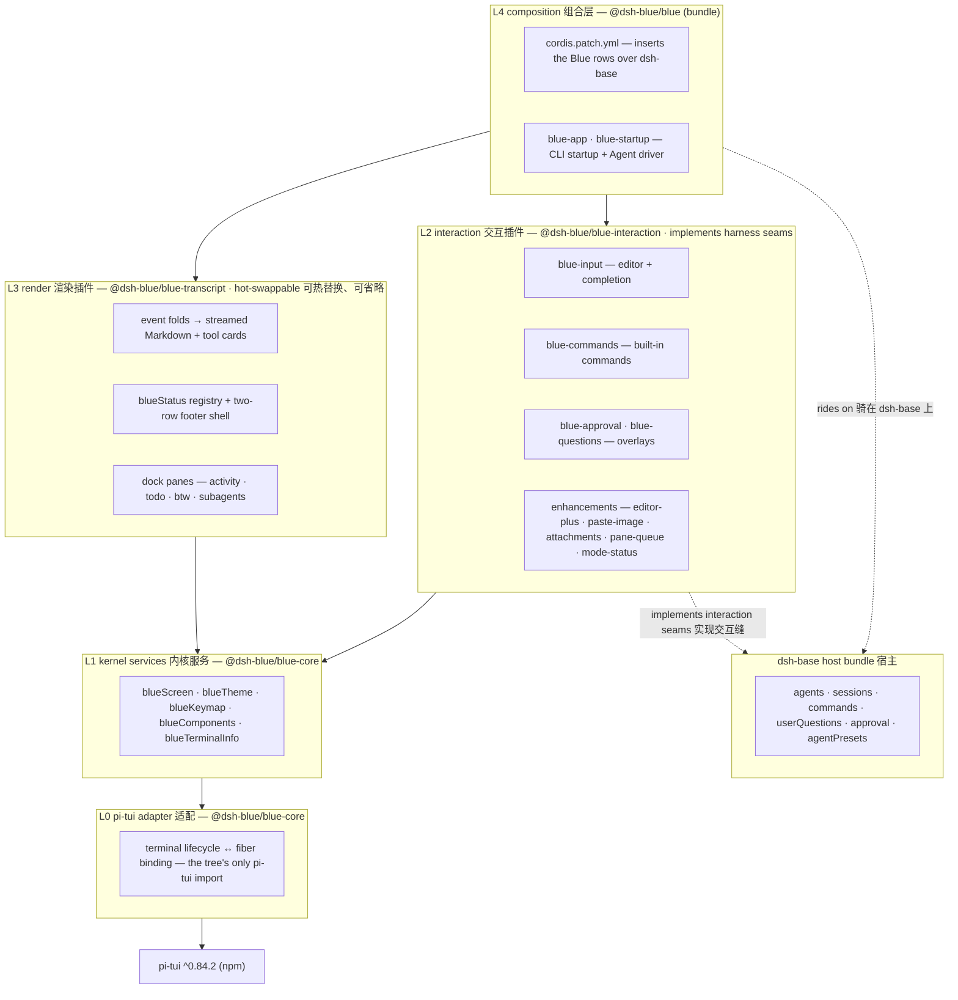
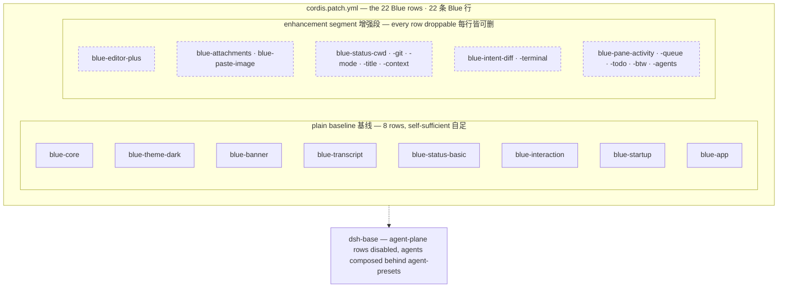

# Blue 架构设计

> 姊妹文档：[blue-roadmap.md](./blue-roadmap.md)（分阶段路线图）、[blue-mvp-plan.md](./history/blue-mvp-plan.md)（MVP 实施计划）、[blue-p1-design.md](./history/blue-p1-design.md)（P1 层职责定稿与缝清单）
> 本文档是 Blue 的架构蓝图：可行性结论、分层设计、核心契约、稳定性机制。代码现状以仓库 `AGENTS.md` 为准。

> **目标架构说明（2026-08）**：跨 renderer 的新目标架构、Domain/Interaction/Renderer/Composition 分层、session runtime 和 provider 热插拔以 [blue-frontend-architecture.md](./blue-frontend-architecture.md) 及其姊妹文档为准。本文保留已落地 Blue TUI 的历史分层和当前实现参考，不代表重构后的最终包边界。

## 1. 背景与可行性结论

Blue 是 deepseek-harness（`dsh`）的交互式终端 UI，基于 `@earendil-works/pi-tui` 渲染，按 harness 的 Cordis 插件哲学组织。可行性的三条事实依据：

1. **pi-tui 可独立使用**：运行时仅 marked + get-east-asian-width 两个依赖，不牵扯 pi 的 agent 体系；diff 渲染、Kitty 键盘协议、Markdown/LaTeX 渲染、Editor、overlay 系统开箱即用，且被 pi 自己的 coding agent 生产级验证。
2. **harness 架构原生预留了 UI 扩展点**：`docs/architecture.md` 把 "Add UI or editor integration" 定义为 "drive `ctx.agents` and render from `session/event`"；interaction 组（`ctx.userQuestions` / `approval/request` / `ctx.commands`）就是 provider 中立的"前端缝"。harness 曾删除过一个基于 pi-tui 的官方 TUI，删除理由是没有真实消费者，而非不可行。
3. **同进程插件是唯一合理路线**：出进程的 SDK（stdio JSON-RPC）缺 mid-turn cancel 和审批回传，交互式 TUI 会被提问/审批卡死。

唯一实质风险：harness 处于 pre-release（明示有破坏性变更）。因此 Blue 的"核心稳定性"不靠 semver，靠**架构隔离**——这是本设计的出发点。

## 2. 设计哲学：Cordis 化，而非上帝类

pi 自己的 coding-agent 用 pi-tui 时收成了一个 6.5k 行的 `InteractiveMode` 类——那是 pi 的组织方式，不是 Cordis 的。Blue 的核心主张：

**TUI 不是一个包，而是一棵 Cordis 插件树。**

- **Everything is a plugin**：渲染组件、交互 provider、命令、状态栏都是独立插件，各有自己的 fiber 生命周期。
- **注册即 effect**：组件挂载、provider 注册、键位注册全部 `ctx.effect`/`ctx.on` 绑定，插件卸载自动回滚——HMR 和会话切换是免费的。
- **能力缝三角色**：definition / provider / consumer 分离。Blue 既消费 harness 的缝（agents、sessions、userQuestions、approval、commands），也向下游开自己的缝。
- **依赖推导加载**：inject 声明依赖，服务不齐就等待；provider 热替换时依赖方自动 unload/reload。

## 3. 分层架构

<!-- BEGIN diagram:blue-layers -->
<!-- single source 单一来源: docs/diagrams/blue-layers.mmd — edit the .mmd, then `pnpm run diagrams:sync` -->

<!-- END diagram:blue-layers -->

依赖严格单向：`core ← transcript / interaction ← app ← bundle`。

从 bundle 视角看同一棵树：`cordis.patch.yml` 分三段插入 23 条 Blue 行。plain 基线（基线段 + 组装段，共 8 行）自足可跑；增强段的每一行都可单独删掉——plain-first（ADR D21）的图景：

<!-- BEGIN diagram:blue-composition -->
<!-- single source 单一来源: docs/diagrams/blue-composition.mmd — edit the .mmd, then `pnpm run diagrams:sync` -->

<!-- END diagram:blue-composition -->

Dock 顺序即插件行序——activity → queue → todo → btw → 子代理分组，编辑器最后挂载；宿主 agent 面被进程级禁用、组合收进预设（ADR D37 薄宿主，`/preset` 切换）。分段的原注释见 `packages/bundle/blue/cordis.patch.yml`。

### L0 — pi-tui 适配层（core 包内部）

全树**只有 core import `@earendil-works/pi-tui`**。职责：`ProcessTerminal` + `TuiAltScreen` 启动（主 `ScrollView` 管会话流，底部 dock 固定，鼠标滚动与应用内选择同归 renderer；退出把最终会话写回主屏 scrollback）；生命周期绑定 fiber（`ctx.effect(() => () => tui.stop())`）；Proxy 稳定 TUI 引用隔离具体 renderer；`createTerminalRelease()` 作为 fail-loud 的 release 接入点（崩溃时恢复终端 raw mode/备用屏/鼠标报告）。

### L1 — 内核服务（稳定核心）

MVP 定稿三个服务：

- **`ctx.blueScreen`**：`addChild`（返回 disposer）/ `removeChild` / `setFocus` / `showOverlay`（返回含 focus/unfocus 的 handle）/ `requestRender` / `columns`
- **`ctx.blueTheme`**：语义色表（accent/border/mdCodeBlock/…），值是 `(text) => string` 函数——pi-tui 的解耦设计，不绑 chalk
- **`ctx.blueKeymap`**：`register(actions)`（整批校验、冲突即抛、返回 disposer）/ `matches` / `getKeys`

P1 经一次性破坏性重排（边界与理由见 [blue-p1-design.md](./history/blue-p1-design.md) §1.2、§2.2 与 ADR D17/D18）扩为：

- **`ctx.blueComponents`**（新增）：pi-tui 能力的 Blue 类型化工厂——Editor/Markdown/SelectList 组件与宽度函数，pi-tui 类型不越界
- **`ctx.blueTerminalInfo`**（新增）：终端事实——OSC 11 探测的背景色、键盘协议能力
- **`ctx.blueTheme`** 拆为契约（core）+ provider 插件（实现）：dark/light/auto/custom 主题插件经 provider 替换热切换
- **`ctx.blueKeymap`** 增 `BlueKeyAction.handler` 可选字段：带 handler 的动作成为全局动作，由 L0 分发器在焦点路由前消费

### L2 — 交互插件（interaction 包）

实现 harness interaction 组的缝：Editor 输入（submit 时 `parseCommand` 分流：命中命令走 `ctx.commands`，否则 `agent.followup()`）、内置命令（`/quit`、`/resume`）、`UserQuestionProvider`（overlay 选择/输入）、approval answerer（`approval/request` waterfall 三态弹窗，不调 `next()` 即短路）。

### L3 — 渲染插件（transcript 包）

统一范式：**`session/event` → 折叠 → 组件子树 → `requestRender()`**，单向数据流，组件不含业务逻辑。纯折叠器 `fold.ts`（`SessionEvent[] → TranscriptItem[]`，无 UI 依赖）；组件层渲染 user/assistant（流式 Markdown）/tool（generic intent）；状态栏为 `blueStatus` 注册表 + transcript 挂载的常驻两行 footer 壳（`addBottomChild` 钉底于编辑器上方，priority 升序 first-fit、溢出丢弃低优先级条目），条目以子路径插件贡献（`status-basic` 基线、`status-git`/`status-context` 增强）。

### L4 — 组合层（bundle/blue）

照 harness `bundle/headless` 模板：startup provider（inject `cmdlineArgs`，commander 解析 `[task]` 和 `--resume`）→ `ctx.provide('blueStartup', …)`；`cordis.patch.yml` 骑 `dsh-base`，用 `!!js ctx.blueStartup.*` 惰性插值注入配置。安装路径为 out-of-tree：`dsh plugin --profile blue-dev add`（见贡献者文档的本地开发安装节）。

## 4. 插件间契约

三个包并行开发时冻结的集成契约，唯一归属 `dsh-blue-app`（`src/types.ts`，declaration merging）：

- **服务 `ctx.blueSession`**：`{ current: Agent | null }` 可变引用，app 启动即 provide；消费者一律 `ctx.get('blueSession')` 读取（不 inject——app 可能晚于消费者激活）
- **事件 `'blue/session-changed'(agent)`**：app 在 create/resume 完成的 commit point 广播（先更新 blueSession 再 emit）
- **事件 `'blue/request-resume'(sessionId)`**：interaction 的 `/resume` 发出，app 串行队列执行 resume（先成功再 dispose 旧 agent，失败保留现场）

**resume 的关键语义**（harness 已核实）：seed 历史**不重播** `session/event`。transcript 必须先读 `agent.session.events` 快照渲染历史，记录末尾 seq，再订阅增量并丢弃 `seq ≤ 快照末尾` 的事件防竞态。

## 5. 核心稳定性机制

### 5.1 L1 签名守门清单（定稿评审标准）

防"改"、允许"加"。L1 签名冻结前逐条过（唯一例外：P1 的一次性层职责重排，见 blue-p1-design §1.2，定稿后恢复只增不改）：

1. 只暴露自有最窄接口（`BlueComponent`），不透传 pi-tui 类型——pi-tui 破坏性变更不得传导出 L0
2. 不含任何 harness 业务类型（Session/Agent/Tool 出现在 L1 签名即驳回）
3. 不含具体实现类（`TuiMainScreen`/`TuiAltScreen` 只允许出现在 L0 内部）
4. 方法正交：挂组件（screen）、取色（theme）、键位（keymap）互不越界
5. 未来的缝（blueStatus、render intent 注册表、focus 事件等）一律作为新服务或 L1 纯增量方法，不允许修改既有签名

### 5.2 三条纪律（累积性约束，违反会污染存量代码）

- 焦点只经 `blueScreen.setFocus` 进出
- 键位一律注册进 `blueKeymap`，禁止硬编码按键检查（冲突在启动期暴露，而非运行时抢键）
- 弹窗只走 `showOverlay` 句柄（含焦点恢复）

### 5.3 缝的设计时机：宪法先行，细则后置

- **MVP 定稿的只有宪法**：L1 签名 + 三条纪律 + "凡表面皆插件"的结构。
- **缝的清单由首个真实消费者驱动**：表面在 MVP 可以是写死的内部实现；第一个具名下游需求出现时提升为缝（开注册表、默认实现降级为第一个注册者、补文档化签名）。不为假想需求开缝——与 harness "无真实消费者不保留产品表面"的哲学一致。
- **P3 是缝的冻结点**：此前随 pre-release 窗口自由调整。

## 6. 下游定制能力

Blue 不是封闭应用，是可被下游插件定制的 surface。定制发生在三个级别：

1. **贡献缝**（registry + disposer，多贡献共存）：状态栏条目、主题、slash 命令、render intent 呈现器
2. **Provider 替换**（单一活跃 provider，热替换自动重载依赖方）：主题 provider、整个 transcript 插件（footer 壳随之替换）、Editor（vim 模式）
3. **组合层**（profile/bundle patch，零代码）：启停、重排任何 Blue 插件

缝的完整清单——每条缝的契约、归属包、plain 默认实现与开放阶段——见 [blue-p1-design.md](./history/blue-p1-design.md) §6。P1 起生效 **plain-first 纪律**（ADR D21）：每个非平凡表面 = 缝 + plain 默认实现，Blue 自家增强与下游插件同权经缝注册；基线 patch 拔掉全部增强行后仍完整可用。

两个重要例子甚至不在 Blue 职责内：定制 preset mode 走 harness 的 `ctx.permissionPresets`、定制 agent-loop 的 tools 走 `ctx.tools.register`——Blue 作为消费方自动继承下游的定制。这是"UI 只做呈现、能力在上游"分层的直接收益。

## 7. 扩展性分析：以 `/btw` 为例

`/btw <text>`（agent 运行中插入旁白，不打断当前 turn）的完整落地路径，展示新功能如何零核心改动接入：

- **命令插件**（L2）：`ctx.commands.register({ name: 'btw', handler })`，handler 按 `agent.status` 分流——running 时 `agent.steer()`，idle 时 `agent.followup()`。注册即 effect，插件卸载命令自动消失。
- **transcript 呈现**（L3）：session 事件里 `source.kind === 'btw'` 的消息换缩进/灰色样式——事件驱动渲染的自然分支，核心不知道 `btw` 存在。
- **补全自动出现**：Editor 的 slash 补全来自 `ctx.commands`，命令注册即列出。

该插件只 inject `commands` 和 `agents`，不 import pi-tui、不认识 transcript。Claude Code 量级的功能（审批 UI、todo 面板、子 agent 呈现、vim 模式、主题切换、自定义命令……）全部同构地落在 L2/L3——复杂度是"插件数量问题"，不是"核心腐化问题"。

## 8. 已知约束与薄弱环节

- **pi-tui 不是响应式框架**：无 VDOM、无声明式状态；约束布局（VStack/ScrollView）仅 alt-screen 可用。Blue 用 Cordis 事件驱动补齐数据流层。
- **无虚拟化**：长 transcript 靠组件级渲染缓存 + 旧消息静态化折叠（P2），收在 transcript 插件内部。
- **单焦点模型**：弹窗叠弹窗的协调靠 `showOverlay` 句柄纪律，P3 考虑加 focus 进出事件（纯增量）。
- **无通用鼠标点击组件 API**：点击交互靠 OSC 8 hyperlink 和 overlay 选择列表兜底。
- **终端能力梯度**：Kitty 系终端体验最完整；老终端沿 pi-tui 的优雅降级路径。
- **harness pre-release 依赖**：Blue 钉 `@deepseek-ai/*@0.1.0-rc.7`，升级版本时跑全量测试套件即完整兼容性验收——这是"只依赖文档化 surface"的回报。
