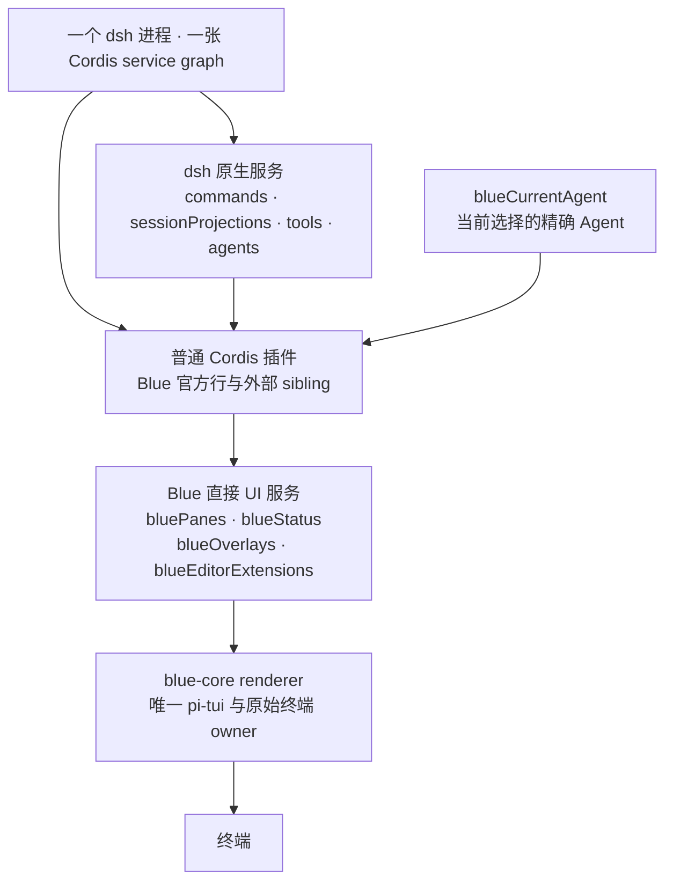
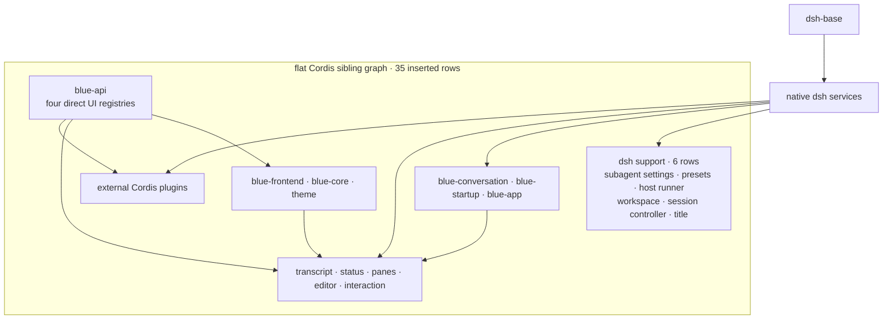

# Blue 2.0 架构

Blue 是 `dsh-base` 上的一组普通 Cordis sibling 插件。它不建立第二个插件
模型，不拦截或复制 dsh service graph，也不为外部插件建立私有 runtime realm。

<!-- BEGIN diagram:blue-layers -->
<!-- single source 单一来源: docs/diagrams/blue-layers.zh.mmd — edit the .mmd, then `pnpm run diagrams:sync` -->

<!-- END diagram:blue-layers -->

## 运行时原则

1. 插件直接 inject 并使用 dsh 原生服务，例如 `commands`、
   `sessionProjections`、`tools` 和 `settings`。与 `planMode` 同 realm 的插件
   可以直接 inject 它；根级 UI 插件通过原生 `plan` projection 读取状态、通过
   原生 `/plan` 命令写入，不增加 Blue adapter。
2. Blue 只增加终端 UI 所需的四个 service：
   `bluePanes`、`blueStatus`、`blueOverlays`、
   `blueEditorExtensions`。
3. `blueCurrentAgent` 只表达当前 Blue frontend 选择的精确 Agent。插件拿到
   Agent 后，仍调用原生 dsh service；该对象不是 renderer model。
4. 注册、listener、timer 与异步 continuation 都属于创建它们的 Cordis Fiber。
   Fiber unload 是唯一的插件贡献清理机制。
5. 只有 `packages/core` import pi-tui、处理 ANSI/raw mode、焦点、布局和
   visible width。

## 包边界

| 包 | 当前职责 |
| --- | --- |
| `api` | renderer-neutral node/event contract 与四个直接 UI registry |
| `ui` | 纯 node builder 和 `defineBlueComponent` |
| `frontend` | renderer-neutral locale、theme、notification 与 transcript models |
| `conversation` | 注册官方 append-origin `sessionProjections` |
| `app` | startup、session navigation、current Agent、request/retraction/title cadence |
| `core` | pi-tui/terminal owner，并渲染 pane/overlay registry |
| `transcript` | projection-backed transcript、tool presentation、status 与 pane contributors |
| `interaction` | editor、原生 dsh commands、dialog 和 editor-extension consumer |
| `bundle/blue` | `dsh-base` 上的 flat composition 与 presets |
| `cli` | dependency-free `blue` launcher |

不存在第二套插件作者工具、Harness service adapter 包、validation-only adapter
包、可替换 provider owner、插件 bridge 或 app session facade。

## 状态所有权

- Harness 的 Agent、Session、command、tool 与 projection 状态仍由 Harness
  package 持有。
- app 持有当前 Agent selection；它不重做 Harness command/tool/projection API。
- API registry 持有当前 UI contribution definitions，且每项 registration 随
  consumer Fiber 清理。
- transcript 与 interaction 持有它们自己的 renderer-neutral/TUI product state。
- core 持有 terminal、focus、layout 与编译后的 renderer object。

Renderer 可以根据当前 Agent 调用 projection snapshot，但不能折叠第二份
Harness session event truth。

## Composition

<!-- BEGIN diagram:blue-composition -->
<!-- single source 单一来源: docs/diagrams/blue-composition.mmd — edit the .mmd, then `pnpm run diagrams:sync` -->

<!-- END diagram:blue-composition -->

`cordis.patch.yml` 插入 35 个普通 sibling：6 个 dsh 支撑行和 29 个 Blue
product 行。YAML 顺序不代表启动顺序；所有顺序要求必须由 `inject` 表达。
动态 Cordis plugin 与官方 Blue 行处在同一 service graph。

## 验证

whole-tree bundle 测试必须证明原生 command/projection/tool service 可达、
current Agent identity 精确、四个 UI service 可注册、Fiber unload 会清理、
core reload 后 registry 仍可重挂 renderer。宽度敏感组件继续接受各包
`width-scan` 检查。
