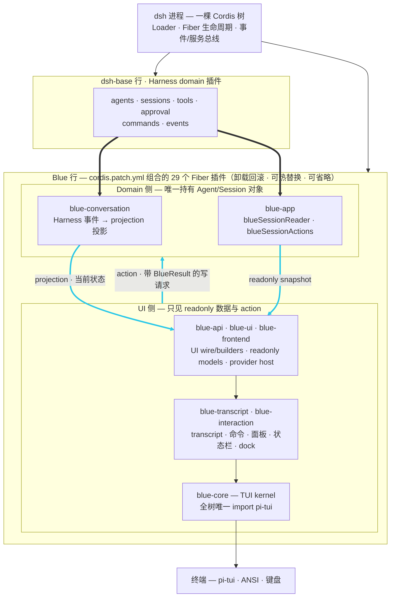
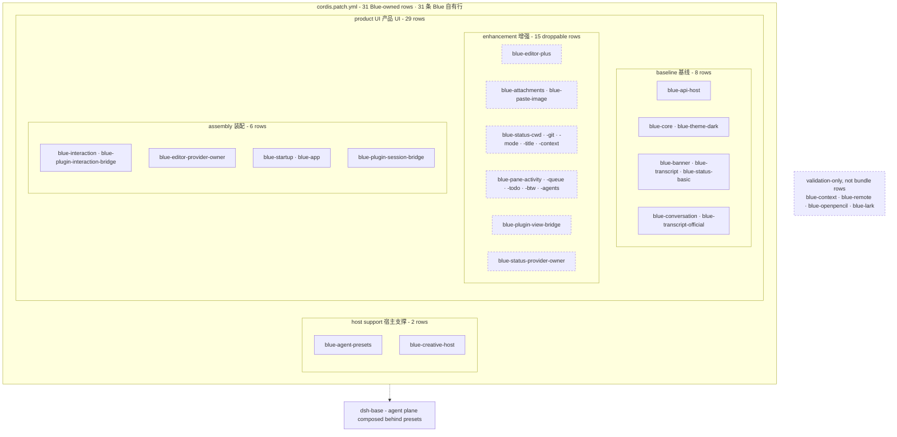

# Blue 架构设计

> 本文描述当前 frontend-runtime cutover 架构。历史阶段设计保存在 `docs/history/`；旧 `blueSession`、event fold、`blueStatus` 和 `blueIntents` 方案已被本架构取代。

## 1. 核心方向

Blue 把 Harness domain 转换为 renderer-neutral frontend model，再由 TUI adapter 呈现：

```text
Harness domain -> projection/action boundary -> frontend model -> TUI adapter -> terminal
```

Harness 继续拥有 Agent、Session、工具、持久化、权限、模型路由和业务事件。Blue 不保存第二套 Agent 真相。事件表示已经发生的事实，projection 表示当前状态，action 表示带结构化结果的写请求。

## 2. 分层

<!-- BEGIN diagram:blue-layers -->
<!-- single source 单一来源: docs/diagrams/blue-layers.mmd — edit the .mmd, then `pnpm run diagrams:sync` -->

<!-- END diagram:blue-layers -->

依赖方向是单向的：

- `blue-conversation` 是 Harness-domain projection，不依赖 frontend 或 renderer。
- `blue-app` 独占 Agent/Session 对象，只向外提供 readonly reader/projection values 和 structured actions。
- `blue-api`、`blue-frontend` 只包含 renderer-neutral contract/model/provider lifecycle。
- `blue-transcript` 与 `blue-interaction` 把 model/action 适配到 TUI feature。
- `blue-core` 是全树唯一 pi-tui、ANSI、raw terminal、focus、layout 和 width-truth owner。
- `blue` bundle 只负责 composition、preset、disable list 和显式依赖顺序。

`blue-context`、`blue-remote`、`blue-openpencil`、`blue-lark` 是 validation-only package，不进入正式 bundle dependency closure。

## 3. 数据流

### Conversation 与 transcript

```text
session/event
  -> blue-conversation (official SessionProjectionRegistry)
  -> blueConversation + blueConversationFacts
  -> app blueSessionProjections values/seq boundary
  -> official transcript / SessionFactsService
  -> TranscriptModel + canonical BlueStatusNode / BlueUiNode producers
  -> transcript TUI components
```

只有 domain/app owner 可以观察原始 session events。Transcript、status 和 pane 不折叠 event log。`blueConversation` 覆盖 user/assistant/thinking/tool/image/error/interruption/retraction 的 replay/live 收敛；`blueConversationFacts` 覆盖 phase、usage、todo、request model 和 child-agent call facts。

### Interaction 与写请求

```text
input / command / panel
  -> blueSessionActions or public Blue action
  -> app-owned Agent operation
  -> Harness durable event/projection
  -> model refresh
```

Renderer 不持有 Agent/Session。切换、followup、steer、interrupt、mode/model/preset/tool/skill、rewind 和 side-session 操作都经过 app action boundary。会话切换以 reader epoch 和 projection seq 驱逐旧 callback。

### 外部插件

```text
manifest
  -> bluePluginHost.open()
  -> capability-scoped pane/overlay/status/command/notification contribution
  -> owner bridge
  -> canonical core compiler / Harness command registry / notice consumer
```

第三方 contribution 与内置 consumer 使用同一 renderer-neutral view vocabulary，但不能访问 Loader、root renderer、Agent 或 Session。

## 4. Scope 与生命周期

| Scope | Owner state |
|---|---|
| host | plugin contribution registries、models/credentials/MCP registries |
| agent | tool/persona/preset composition，始终留在 Harness/app owner |
| session | official projection cells、durable actions 和 watermark |
| frontend tree | editor host、draft、alias/settings cache、paste state、transcript presentation policy |
| provider Fiber | subscription、timer、abort controller、renderer component cache |

Provider swap 必须遵循 `capture -> abort -> dispose -> activate -> restore`。每个 async callback 都检查 generation/session epoch；卸载后不得重新挂载 UI 或写入替换 session。

## 5. Renderer 边界

`blue-core` 提供 `blueScreen`、`blueKeymap`、`blueComponents`、`blueTerminalInfo` 和 theme provider。其它包不得 import pi-tui 或自行实现 visible-width math。

`blue-transcript` 拥有：

- semantic `TranscriptModelService` 与最多 200 项的 renderer reconciliation；
- package-private `BlueStatusEntryService` 两行 footer；
- package-private、bottom-only `BlueBottomPaneService`；public panes/overlays 由 core surface bridge 独立挂载；
- official tool presentation -> canonical `ToolPresentationModel.call/result` node conversion；
- frontend-tree-scoped `TranscriptPresentationPolicy`。

`blue-interaction` 拥有：

- input/editor 与通用 panel components；
- frontend-tree-scoped `EditorHostService` 和 `InteractionStateService`；
- command/question/approval workflows；
- abort、unload 和 late-result rejection。

旧 `fold.ts`、七种 frontend `View`、core `frontend-renderer`、generic frontend status/dock model、`blueIntents`、intent subpath、child event tracker 和 shared-editor singleton 已删除。Provider、tool、generic transcript 与 context UI data 均使用 canonical `BlueUiNode`；公共 `BlueView` 仅是 canonical content-leaf subset。

## 6. 包职责

| Package | Role |
|---|---|
| `@dsh-blue/blue-api` | 稳定 manifest、`BlueResult`、readonly public views 与 capability-scoped plugin host |
| `@dsh-blue/blue-frontend` | readonly command/editor/transcript/tool/theme models 与 provider host |
| `@dsh-blue/blue-harness-adapter` | session/projection/action/model/question 的窄兼容 adapter |
| `@dsh-blue/blue-conversation` | append-origin conversation 与 shared facts official projections |
| `@dsh-blue/blue-app` | CLI startup、Agent driver、session reader/projection/action boundary |
| `@dsh-blue/blue-core` | 唯一 TUI kernel 与 terminal adapter |
| `@dsh-blue/blue-transcript` | transcript/status/bottom-pane/tool model consumer 与 TUI renderer |
| `@dsh-blue/blue-interaction` | editor、commands、panels、question/approval 与 tree-scoped interaction state |
| `@dsh-blue/blue` | installable composition、thin-host preset 和 row-order assertions |
| `@dsh-blue/blue-cli` | standalone launcher 与 profile calibration |

## 7. Bundle composition

<!-- BEGIN diagram:blue-composition -->
<!-- single source 单一来源: docs/diagrams/blue-composition.mmd — edit the .mmd, then `pnpm run diagrams:sync` -->

<!-- END diagram:blue-composition -->

31 条 Blue 自有行由 2 条 host-support 和 29 条 product row 组成。产品段内：

- baseline 8 行，包含 conversation projection 与 official transcript consumer；
- enhancement 15 行，可逐项移除；
- assembly 6 行，提供 interaction、provider/public bridge、startup、app 与 public session owner bridge。

Dock 的稳定顺序由 model priority/id 加显式 row-level `inject` 共同约束，不依赖 Cordis sibling 碰巧按文件顺序完成。

## 8. 验证门禁

每个新 surface 必须同时有 official consumer、headless fixture、unload/swap、replay/late-result、width scan、bundle composition 和 real-profile evidence。Subpath export 必须同步 package `exports`、`files` 和 `tsdown.config.ts`。完整 cutover 状态见 [blue-runtime-cutover-ledger.md](./blue-runtime-cutover-ledger.md)。
