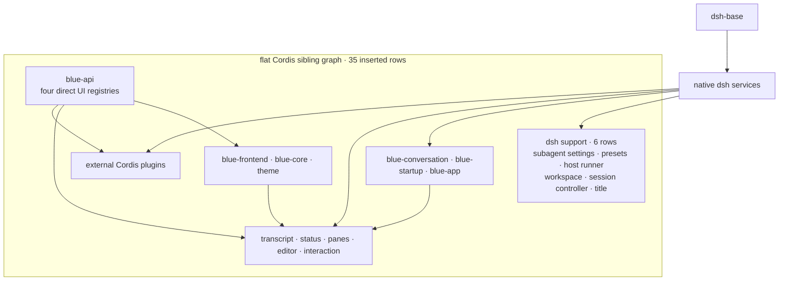

# Built-in plugins

The Blue bundle inserts 31 ordinary Cordis siblings over `dsh-base`: six dsh
support rows and 25 Blue product rows. There is no group/isolate or private
service realm.

<!-- BEGIN diagram:blue-composition -->
<!-- single source 单一来源: docs/diagrams/blue-composition.mmd — edit the .mmd, then `pnpm run diagrams:sync` -->

<!-- END diagram:blue-composition -->

## Support rows

- subagent model settings and agent presets;
- dynamic Cordis host runner;
- session controller;
- all-prompts title provider.

## Blue rows

- `blue-api`: four direct UI registries;
- `blue-frontend`, `blue-core`, and dark theme;
- `blue-conversation`, startup, app/current Agent;
- banner, transcript, and official model;
- basic/cwd/git/title/context/mode status;
- activity/queue/todo/BTW/agents panes;
- attachments, paste image, editor-plus, and interaction.

External plugin rows share this service graph. Activation dependencies come
from `inject`, not YAML position. Every built-in status or pane uses the same
`blueStatus`/`bluePanes` registry available to external plugins.
