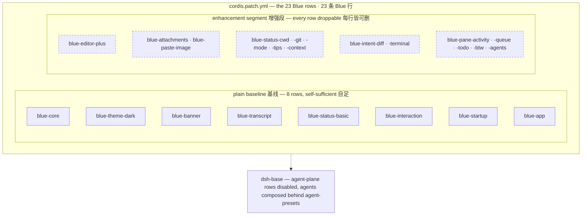

# Built-in plugins

Every surface in Blue is a plugin (a patch row) — this page is the directory of the 23 built-ins. They double as living examples of what plugins can do: status entries, tool cards, editor enhancements, whole panes — all registered through the seams in the [Seam reference](/en/plugins/seams), each removable.

The three-segment structure at a glance (same single source as the repo READMEs, `docs/diagrams/blue-composition.mmd`):

<!-- BEGIN diagram:blue-composition -->
<!-- single source 单一来源: docs/diagrams/blue-composition.mmd — edit the .mmd, then `pnpm run diagrams:sync` -->

<!-- END diagram:blue-composition -->

## Baseline plugins (5)

The five plugins composing the minimal usable Blue UI — the plain baseline, best kept as a group:

| Plugin | Description |
| --- | --- |
| `blue-core` | terminal core: the tree's only pi-tui adapter, providing the screen/keymap/component-factory/terminal-facts services |
| `blue-theme-dark` | built-in dark palette (the plain default provider of `blueTheme`) |
| `blue-banner` | boot welcome banner: model · provider, cwd, tips, what's new |
| `blue-transcript` | the transcript body: event folding and rendering, the status registry and two-row footer shell |
| `blue-status-basic` | baseline status entry: the model name (priority 0) |

## Enhancement plugins (15, individually toggleable)

Optional layers over the plain baseline — every row deletes on its own without breaking it:

| Plugin | Description |
| --- | --- |
| `blue-editor-plus` | editor enhancements: `!` bash mode + slash/`@` autocomplete + argument ghost hints |
| `blue-attachments` | attachment store: filesystem image library (magic-byte sniffing, size caps) |
| `blue-paste-image` | Ctrl-V clipboard paste with `[image #N]` markers, split into image blocks on submit |
| `blue-status-cwd` | status: session cwd (priority 5, deep-path shortening) |
| `blue-status-git` | status: git badge `branch [+a -d ↑u↓v]` (priority 10, TTL-cached probe) |
| `blue-status-mode` | status: session-mode badge `plan`/`yolo` (priority 2, hidden in normal) |
| `blue-status-tips` | status: rotating teaching tips (priority 30, advancing every 10s) |
| `blue-status-context` | status: context occupancy `context: N%` (priority 20, row 2 right-aligned) |
| `blue-intent-diff` | dedicated diff tool card (unified-diff coloring for Write/Edit) |
| `blue-intent-terminal` | dedicated terminal-output tool card (`$ command` + exit badge) |
| `blue-pane-activity` | activity pane: waiting/running/composing mode indicator (moon and braille spinners) |
| `blue-pane-queue` | queued-messages pane + empty-editor Up recall |
| `blue-pane-todo` | todo pane (Ctrl-T collapse toggle, auto-close when all done) |
| `blue-pane-btw` | `/btw` side-question pane: fork the live session for a by-the-way question |
| `blue-pane-agents` | subagent-group pane: running subagent group card (last dock row, the kimi swarm-pane semantics) |

## Assembly plugins (3)

The closing assembly layer providing input interaction and the Agent driver:

| Plugin | Description |
| --- | --- |
| `blue-interaction` | input editor, built-in commands, questionnaire provider, approval answerer |
| `blue-startup` | startup values provider: `[task]` positional and `--resume` parsing |
| `blue-app` | Agent driver: creates/resumes the session and publishes `blueSession` |

## Toggling and customization

Built-in plugins need no install — they are the bundle's `cordis.patch.yml` rows. To customize the set, edit your profile's patch file directly (after `dsh plugin --profile blue add link:…`, the patch lives in the profile directory); the three-segment assembly and dock-order mechanics are covered in the [features overview](/en/features/).

For discovering and one-line-installing ecosystem plugins, see the [plugin marketplace](/en/marketplace/) (under construction).
