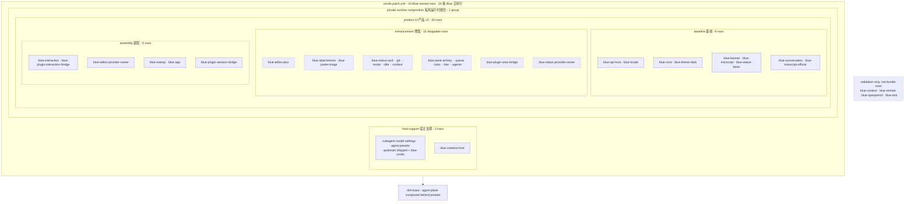

# Built-in plugins

The installable Blue bundle contains 34 Blue-owned rows: three host-support rows, one private-runtime composition group, and 30 product rows wrapped by that group and split into baseline, enhancement, and assembly segments. External plugins integrate through the renderer-neutral public Beta API; internal rows connect through explicit `inject` dependencies and model/action seams.

The patch also carries one Harness insert row, `session-title-all-prompts-llm` (the title-cadence swap: the base's `session-title-llm`, which titles once from the first prompt, is disabled in favor of re-titling on every user message, so a bad title self-corrects on the next one). It is not Blue-owned and is therefore excluded from the 34-row count above.

<!-- BEGIN diagram:blue-composition -->
<!-- single source 单一来源: docs/diagrams/blue-composition.mmd — edit the .mmd, then `pnpm run diagrams:sync` -->

<!-- END diagram:blue-composition -->

## Host support (2 rows)

| Plugin | Description |
|---|---|
| `agent-presets` | Loads upstream shipped `standard/minimal/ptc/cordis` and the user root directly; Blue adds only the uniquely named `blue-cordis` preset, with no copied upstream directories or `code` alias |
| `blue-creative-host` | isolated dynamic Cordis host whose only UI route is the public plugin host |

## Private runtime composition (1 group row)

`blue-runtime-private` wraps all 30 product rows. It isolates `bluePluginControl`, `blueSessionReader`, `blueSessionProjections`, and `blueSessionActions` while allowing the guarded public `bluePluginHost` to cross the boundary and provide manifest-scoped facades. Ordinary siblings and Creative Mode children cannot self-attach an owner, observe aggregates/global notifications, mint gestures, close another plugin's overlay, or read raw app truth.

## Baseline (9 rows)

These nine rows plus assembly form the minimum usable UI. The locale runtime/settings adapter provides deterministic system/English fallback; the conversation producer and consumer are baseline because no legacy event fold remains.

| Plugin | Description |
|---|---|
| `blue-api-host` | `1.0.0-beta.1` manifest validation and scoped Beta/Experimental facets; management control remains private |
| `blue-locale` | frontend-tree locale runtime bound to official `locale.preference` and system-language fallback |
| `blue-core` | only pi-tui/raw-terminal adapter; screen, keymap, components, and terminal facts |
| `blue-theme-dark` | default dark theme provider |
| `blue-banner` | startup welcome banner |
| `blue-transcript` | transcript model, canonical status/bottom-pane hosts, tool model, and TUI renderer |
| `blue-status-basic` | model-name footer canonical status-node producer |
| `blue-conversation` | official append-origin conversation and shared-facts projections |
| `blue-transcript-official` | semantic consumer of whole projection snapshots/change feeds |

## Enhancements (15 rows)

| Plugin | Description |
|---|---|
| `blue-editor-plus` | bash mode, slash/`@`/`#` completion, and argument hints |
| `blue-attachments` | bounded filesystem image store |
| `blue-paste-image` | Ctrl-V clipboard paste with `[image #N]` markers, split into image blocks on submit (a reversible submit transformation) |
| `blue-status-cwd` | current session cwd (deep-path shortening) |
| `blue-status-git` | TTL-cached git badge `branch [+a -d ↑u↓v]` |
| `blue-status-mode` | plan/yolo mode badge |
| `blue-status-title` | projected session title |
| `blue-status-context` | projected context occupancy |
| `blue-pane-activity` | projection-backed activity model |
| `blue-pane-queue` | app-action-backed queued-message model |
| `blue-pane-todo` | projection-backed todo model (Ctrl-T collapse toggle, auto-close when all done) |
| `blue-pane-btw` | `/btw` side-question pane: fork the live session for a by-the-way question (opaque owned side-session action plus official projection) |
| `blue-pane-agents` | projected subagent-group model (last dock row, the kimi swarm-pane semantics) |
| `blue-plugin-view-bridge` | public additive status contributions into the footer owner registry |
| `blue-status-provider-owner` | Experimental/reference exclusive status-provider selection, session/settings handoff, and fallback lifecycle owner |

## Assembly (6 rows)

| Plugin | Description |
|---|---|
| `blue-interaction` | editor, commands, panels, and question/approval providers |
| `blue-editor-provider-owner` | Experimental/reference: selects the exclusive editor shell through `blue.editorProvider`, preserving the editor engine and owning fallback/rollback |
| `blue-plugin-interaction-bridge` | public command/publish-only notification plus Experimental editor-extension contributions into Harness/editor consumers |
| `blue-startup` | `[task]` and `--resume` startup values |
| `blue-app` | Agent driver providing readonly session reader/projections and structured actions |
| `blue-plugin-session-bridge` | uses private control to adapt app read sources into exact-field `session.read` and exact-key `session.projections.read` |

## Validation-only packages

`blue-context` and `blue-remote` prove adapter architecture through independent fixtures; `blue-openpencil` and `blue-lark` are exercised by their own vitest suites plus the dev-profile link. None of the four are bundle rows or enter the release dependency closure.

A profile patch can customize composition. Removing a projection-backed baseline row removes a core product capability; the 15 enhancement rows are the layer designed for independent removal.
