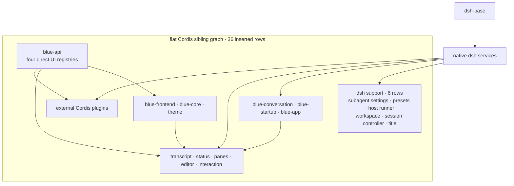

# 内置插件

Blue bundle 在 `dsh-base` 上插入 36 个普通 Cordis sibling：6 个 dsh 支撑行
与 30 个 Blue product 行。不存在 group/isolate 或私有 service realm。

<!-- BEGIN diagram:blue-composition -->
<!-- single source 单一来源: docs/diagrams/blue-composition.mmd — edit the .mmd, then `pnpm run diagrams:sync` -->

<!-- END diagram:blue-composition -->

## 支撑行

- subagent model settings、agent presets；
- dynamic Cordis host runner；
- session controller；
- all-prompts title provider。

## Blue 行

- `blue-api`：四个直接 UI registry；
- `blue-frontend`、`blue-core`、dark theme；
- `blue-conversation`、startup、app/current Agent；
- banner、transcript、official model；
- basic/cwd/git/title/context/mode/jobs/goal status；
- activity/queue/todo/BTW/agents/workflow pane；
- jobs 与 agents command、attachments、paste image、editor-plus、interaction。

外部 plugin row 与这些行处于同一 service graph。启动依赖全部由 `inject`
决定，而不是 YAML 行序。任何内置 status/pane 都使用与外部插件相同的
`blueStatus`/`bluePanes` registry。
