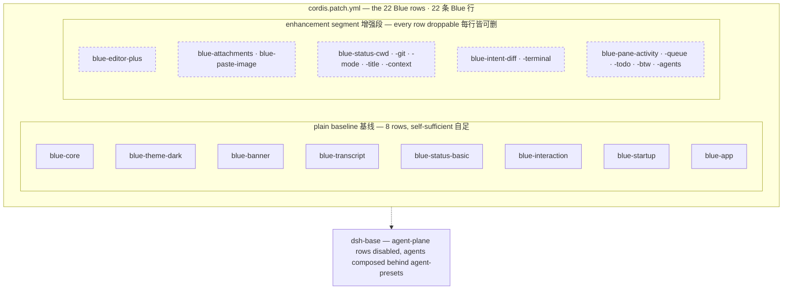

# 内置插件

Blue 的一切表面都是插件（patch 行）——本页是 22 个内置插件的目录。它们同时也是"插件能做什么"的活例子：状态栏条目、工具卡片、编辑器增强、完整面板，全部经 [Seam 参考](/plugins/seams)里的缝注册，逐个可拆。

三段结构一张图（与仓库 README 同源，单一来源 `docs/diagrams/blue-composition.mmd`）：

<!-- BEGIN diagram:blue-composition -->
<!-- single source 单一来源: docs/diagrams/blue-composition.mmd — edit the .mmd, then `pnpm run diagrams:sync` -->

<!-- END diagram:blue-composition -->

## 基线插件（5 个）

组成最小可用 Blue UI 的五个插件——纯基线，建议整组保留：

| 插件 | 说明 |
| --- | --- |
| `blue-core` | 终端核心：全树唯一的 pi-tui 适配器，提供屏幕/键位/组件工厂/终端事实四项服务 |
| `blue-theme-dark` | 内置 dark 调色板（`blueTheme` 服务的 plain 默认提供方） |
| `blue-banner` | 启动欢迎横幅：模型 · provider、cwd、tips、What's new |
| `blue-transcript` | 会话流主体：事件折叠与渲染、状态栏注册表与两行 footer 壳 |
| `blue-status-basic` | 状态栏基线条目：model 名（优先级 0） |

## 增强插件（14 个，均可独立启停）

在纯基线之上的可选层——每一行都可单独删除而不破坏基线：

| 插件 | 说明 |
| --- | --- |
| `blue-editor-plus` | 输入编辑器增强：`!` bash 模式 + 斜杠/`@` 补全 + 参数幽灵提示 |
| `blue-attachments` | 附件存储：文件系统图片库（魔数嗅探、容量上限） |
| `blue-paste-image` | Ctrl-V 剪贴板贴图，`[image #N]` 标记，提交拆为图片块 |
| `blue-status-cwd` | 状态栏：会话工作目录（优先级 5，深路径缩写） |
| `blue-status-git` | 状态栏：git 徽章 `branch [+a -d ↑u↓v]`（优先级 10，TTL 缓存探测） |
| `blue-status-mode` | 状态栏：会话模式徽标 `plan`/`yolo`（优先级 2，normal 态隐藏） |
| `blue-status-title` | 状态栏：会话标题（优先级 30，行 1 右对齐；S30 换位前是轮换教学提示的槽位） |
| `blue-status-context` | 状态栏：context 占用 `context: N%`（优先级 20，第二行右对齐） |
| `blue-intent-diff` | diff 专属工具卡（Write/Edit 的统一 diff 着色呈现） |
| `blue-intent-terminal` | 终端输出专属工具卡（`$ command` + exit 徽章） |
| `blue-pane-activity` | 活动面板：等待/运行/撰写的模式指示（月亮与 braille spinner） |
| `blue-pane-queue` | 排队消息面板 + 空编辑器 Up 召回 |
| `blue-pane-todo` | todo 面板（Ctrl-T 折叠切换，全完成自动收起） |
| `blue-pane-btw` | `/btw` 侧问面板：fork 当前会话问旁路问题 |
| `blue-pane-agents` | 子代理分组面板：运行中的子代理组卡片（dock 末行，kimi swarm-pane 语义） |

## 装配插件（3 个）

收尾装配层，提供输入交互与 Agent 驱动：

| 插件 | 说明 |
| --- | --- |
| `blue-interaction` | 输入编辑器、内置命令、问卷 provider、审批应答方 |
| `blue-startup` | 启动值提供方：`[task]` 位置参数与 `--resume` 解析 |
| `blue-app` | Agent 驱动：创建/恢复会话并发布 `blueSession` |

## 启停与定制

内置插件无需安装——它们就是 bundle 的 `cordis.patch.yml` 行。想定制组合时，直接编辑 profile 的 patch 文件增删行即可（`dsh plugin --profile blue add link:…` 装入后，patch 位于 profile 目录下）；三段式装配与 dock 顺序的机制说明见[功能总览](/features/)。

生态插件的发现与一键安装见[插件市场](/marketplace/)（建设中）。
