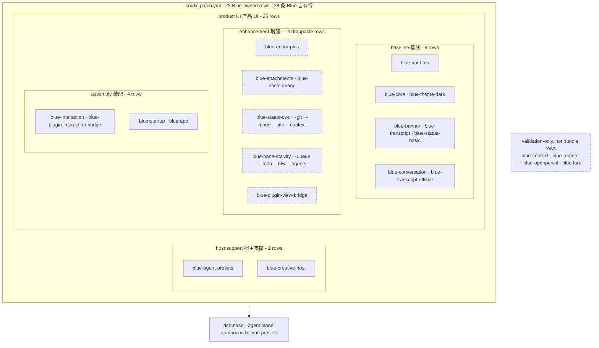

# 内置插件

Blue 的 installable bundle 含 28 条 Blue 自有行：2 条宿主支撑行，以及按基线、增强、装配三段组织的 26 条产品行。外部插件通过 renderer-neutral public API 接入；内部 row 之间用显式 `inject` 和 model/action seam 连接。

patch 里实际还有第 29 条 insert 行——Harness 的 `session-title-all-prompts-llm`（标题节奏 swap：禁用 base 的 `session-title-llm` 首条消息定标题，换成每条用户消息重拟标题、歪标题下条自纠）。它是 Harness 包而非 Blue 自有行，所以上面的 28 行口径不含它。

<!-- BEGIN diagram:blue-composition -->
<!-- single source 单一来源: docs/diagrams/blue-composition.mmd — edit the .mmd, then `pnpm run diagrams:sync` -->

<!-- END diagram:blue-composition -->

## 宿主支撑（2 行）

| 插件 | 说明 |
|---|---|
| `blue-agent-presets` | Blue 自有 preset root，组成 standard/ptc/minimal agent plane |
| `blue-creative-host` | 隔离的 dynamic Cordis host；只经 public plugin host 向 UI 贡献 |

## 基线（8 行）

这 8 行加装配段构成最小可用 UI。Conversation producer/consumer 已是基线，因为旧 event fold 不再存在。

| 插件 | 说明 |
|---|---|
| `blue-api-host` | manifest 校验与 capability-scoped command/status/dock/notification registries |
| `blue-core` | 唯一 pi-tui/raw-terminal adapter，提供 screen/keymap/components/terminal facts |
| `blue-theme-dark` | 默认 dark theme provider |
| `blue-banner` | 启动欢迎横幅 |
| `blue-transcript` | transcript/status/dock/tool model host 与 TUI renderer |
| `blue-status-basic` | model 名 footer `StatusModel` producer |
| `blue-conversation` | official append-origin conversation + shared facts projections |
| `blue-transcript-official` | whole projection snapshot/feed 的 semantic transcript consumer |

## 增强（14 行）

| 插件 | 说明 |
|---|---|
| `blue-editor-plus` | bash mode、slash/`@`/`#` completion 与参数提示 |
| `blue-attachments` | 有界文件系统图片 store |
| `blue-paste-image` | Ctrl-V 剪贴板贴图，`[image #N]` 标记，提交拆为图片块（submit transformation 可回滚） |
| `blue-status-cwd` | 当前 session cwd（深路径缩写） |
| `blue-status-git` | TTL-cached git badge `branch [+a -d ↑u↓v]` |
| `blue-status-mode` | plan/yolo mode badge |
| `blue-status-title` | projected session title |
| `blue-status-context` | projected context occupancy |
| `blue-pane-activity` | projection-backed activity model |
| `blue-pane-queue` | app action-backed queued-message model |
| `blue-pane-todo` | projection-backed todo model（Ctrl-T 折叠切换，全完成自动收起） |
| `blue-pane-btw` | `/btw` 侧问面板：fork 当前会话问旁路问题（opaque owned side-session action + official projection） |
| `blue-pane-agents` | projected subagent group model（dock 末行，kimi swarm-pane 语义） |
| `blue-plugin-view-bridge` | public status/dock contributions -> owner model registries |

## 装配（4 行）

| 插件 | 说明 |
|---|---|
| `blue-interaction` | editor、commands、panels、question/approval providers |
| `blue-plugin-interaction-bridge` | public command/notification contributions -> Harness/editor consumer |
| `blue-startup` | `[task]` 与 `--resume` 启动值 |
| `blue-app` | Agent driver；提供 readonly session reader/projections 和 structured actions |

## Validation-only 包

`blue-context` 与 `blue-remote` 通过独立 fixture 验证 adapter 架构；`blue-openpencil` 与 `blue-lark` 由各自 vitest 套件加 dev profile link 同车验证。四者均不是 bundle row，也不进入正式 release dependency closure。

想定制组合时可编辑 profile 的 patch；删除 projection-backed baseline row 会移除核心产品能力，14 条 enhancement row 才是设计为逐项可移除的层。
