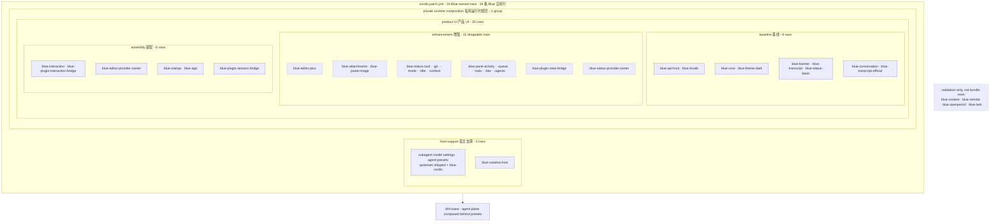

# 内置插件

Blue 的 installable bundle 含 34 条 Blue 自有行：3 条宿主支撑行、1 条 private runtime composition group，以及按基线、增强、装配三段组织并被该 group 包住的 30 条产品行。外部插件通过 renderer-neutral public Beta API 接入；内部 row 之间用显式 `inject` 和 model/action seam 连接。

patch 里另外还有 1 条 Harness insert 行 `session-title-all-prompts-llm`（标题节奏 swap：禁用 base 的 `session-title-llm` 首条消息定标题，换成每条用户消息重拟标题、歪标题下条自纠）。它不是 Blue 自有行，因此不计入上面的 34 条。

<!-- BEGIN diagram:blue-composition -->
<!-- single source 单一来源: docs/diagrams/blue-composition.mmd — edit the .mmd, then `pnpm run diagrams:sync` -->

<!-- END diagram:blue-composition -->

## 宿主支撑（2 行）

| 插件 | 说明 |
|---|---|
| `agent-presets` | 直接装载上游 shipped `standard/minimal/ptc/cordis` 与 user root；Blue 只追加唯一 `blue-cordis` preset，不复制上游目录，也不提供 `code` alias |
| `blue-creative-host` | 隔离的 dynamic Cordis host；只经 public plugin host 向 UI 贡献 |

## 私有运行时组合（1 条 group row）

`blue-runtime-private` 包住全部 30 条产品 row。它隔离 `bluePluginControl`、`blueSessionReader`、`blueSessionProjections` 与 `blueSessionActions`，同时允许 guarded public `bluePluginHost` 跨过边界供普通插件取得 manifest-scoped facade。普通 sibling 和创造模式 child 都不能 self-attach owner、观察 aggregate/global notification、mint gesture、关闭别人的 overlay 或读取 raw app truth。

## 基线（9 行）

这 9 行加装配段构成最小可用 UI。Locale runtime/settings adapter 提供确定性的系统/英文 fallback；Conversation producer/consumer 已是基线，因为旧 event fold 不再存在。

| 插件 | 说明 |
|---|---|
| `blue-api-host` | `1.0.0-beta.1` manifest 校验与 Beta/Experimental facet 的 scoped registries；management control 保持私有 |
| `blue-locale` | frontend-tree locale runtime；绑定官方 `locale.preference` 并跟随系统语言 |
| `blue-core` | 唯一 pi-tui/raw-terminal adapter，提供 screen/keymap/components/terminal facts |
| `blue-theme-dark` | 默认 dark theme provider |
| `blue-banner` | 启动欢迎横幅 |
| `blue-transcript` | transcript model、canonical status/bottom-pane host、tool model 与 TUI renderer |
| `blue-status-basic` | model 名 footer canonical status-node producer |
| `blue-conversation` | official append-origin conversation + shared facts projections |
| `blue-transcript-official` | whole projection snapshot/feed 的 semantic transcript consumer |

## 增强（15 行）

| 插件 | 说明 |
|---|---|
| `blue-editor-plus` | bash mode、slash/`@`/`#` completion 与参数提示 |
| `blue-attachments` | 有界文件系统图片 store |
| `blue-paste-image` | Ctrl-V 剪贴板贴图，`[image #N]` 标记，提交拆为图片块（submit transformation 可回滚） |
| `blue-status-cwd` | 当前 session cwd（深路径缩写） |
| `blue-status-git` | TTL-cached git badge `branch [+a -d ↑u↓v]` |
| `blue-status-mode` | plan/yolo mode badge |
| `blue-status-title` | projected session title |
| `blue-status-context` | projected context occupancy |
| `blue-pane-activity` | projection-backed activity model |
| `blue-pane-queue` | app action-backed queued-message model |
| `blue-pane-todo` | projection-backed todo model（Ctrl-T 折叠切换，全完成自动收起） |
| `blue-pane-btw` | `/btw` 侧问面板：fork 当前会话问旁路问题（opaque owned side-session action + official projection） |
| `blue-pane-agents` | projected subagent group model（dock 末行，kimi swarm-pane 语义） |
| `blue-plugin-view-bridge` | public additive status contributions -> footer owner registry |
| `blue-status-provider-owner` | Experimental/reference exclusive status-provider selection、session/settings handoff 与 fallback lifecycle owner |

## 装配（6 行）

| 插件 | 说明 |
|---|---|
| `blue-interaction` | editor、commands、panels、question/approval providers |
| `blue-editor-provider-owner` | Experimental/reference：按 `blue.editorProvider` 选择独占 editor shell，保留 editor engine 并管理 fallback/rollback |
| `blue-plugin-interaction-bridge` | public command/publish-only notification 与 Experimental editor-extension contribution -> Harness/editor consumer |
| `blue-startup` | `[task]` 与 `--resume` 启动值 |
| `blue-app` | Agent driver；提供 readonly session reader/projections 和 structured actions |
| `blue-plugin-session-bridge` | 通过 private control 把 app read sources 装配为 exact-field `session.read` 与 exact-key `session.projections.read` |

## Validation-only 包

`blue-context` 与 `blue-remote` 通过独立 fixture 验证 adapter 架构；`blue-openpencil` 与 `blue-lark` 由各自 vitest 套件加 dev profile link 同车验证。四者均不是 bundle row，也不进入正式 release dependency closure。

想定制组合时可编辑 profile 的 patch；删除 projection-backed baseline row 会移除核心产品能力，15 条 enhancement row 才是设计为逐项可移除的层。
